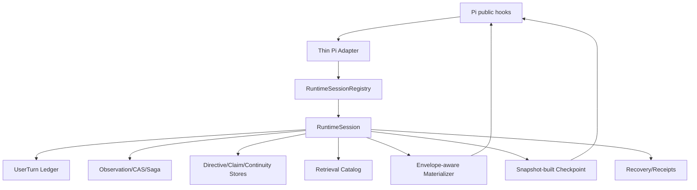

# 目标架构修正版

## 强制边界

- Pi Adapter 不直接 new Materializer/CompactionService/Store；
- 一个 RuntimeSession 持有一个 cursor 与一组 scope-complete ports；
- Context 与 Compaction 必须读同一 committed heads；
- Snapshot transaction 产生 `snapshotHash`，Checkpoint/MaterializedView 都绑定该 hash；
- raw envelope pricing 与实际 `toPi` payload 一致；
- audit metadata 默认放 details，不全部进入模型；
- soft reject 返回 Native；hard integrity 失败 abort；
- recovery/background 未通过 Gate 时不注册产品行为。
