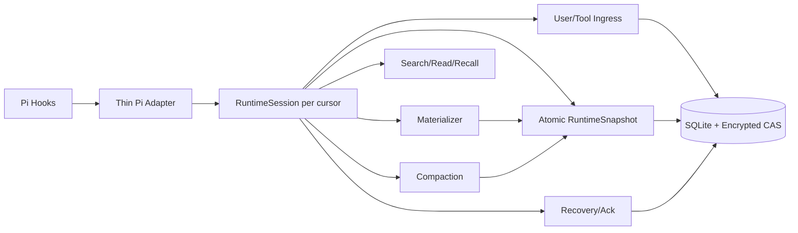

# Runtime 架构与文档一致性

## 目标架构



## 已对齐

- Cursor 从 `cwd + sessionManager + model` 派生；
- Owner/Session Map 已存在；
- RuntimeSession 提供 mutate/read 排它语义；
- Store、CAS、Saga、Evidence、FTS、Directive、Claim、Continuity Ports 已具备；
- Context/Compaction 主 Hook 已开始通过 `openSession()` 获取 RuntimeSession。

## P0：Ingress 并未通过 RuntimeSession

`apps/pi-context-runtime/src/composition-root.ts:887-905`：

```ts
await sessionFor(owner, cursor, ctx);
return owner.service(cursor);       // user
return owner.observation(cursor);   // tool_result
```

而 `RuntimeSession` 在 `packages/runtime/src/runtime-session.ts:184-207` 提供唯一写队列。当前绑定意味着：

- User/Tool 写不受 Session write chain 保护；
- Compaction/Recovery/Branch 与 Ingress 可能并发看到中间状态；
- “所有 Hook 通过唯一 RuntimeSession”这一提交/任务声明不成立。

## P0：Lifecycle 仍是全局状态

`extension.ts:207-235` 使用单个 `lastRecoveredCursor`。多个 Session 交错时，branch/shutdown 可能引用另一个 Session 的 previous/current cursor。`composition-root.ts:912-919` 的任意 `session_shutdown` 又会 close 所有 owners。

## P1：Unbound 仍存在于默认扩展

`extension.ts:237-260` 和 `332-384` 仍为 Background/Tool/Doctor 创建 `unbound`/zero cursor 与 fixture hash。主请求路径虽然更严格，但产品“不允许无 Scope 降级”的不变量尚未全局成立。

## 改造边界

- Adapter 只能调用 RuntimeSession Application Methods；
- RuntimeSession 持有 per-cursor 状态和 durable ports；
- Extension 只处理 Host event codec/ack，不直接调用 Store、Evidence、Reducer；
- Lifecycle Map 以 `workspaceId/sessionId/leafId/lineageHash/modelKey` 为 Key；
- `session_shutdown` 是 scoped close，Extension release 才 close-all。
