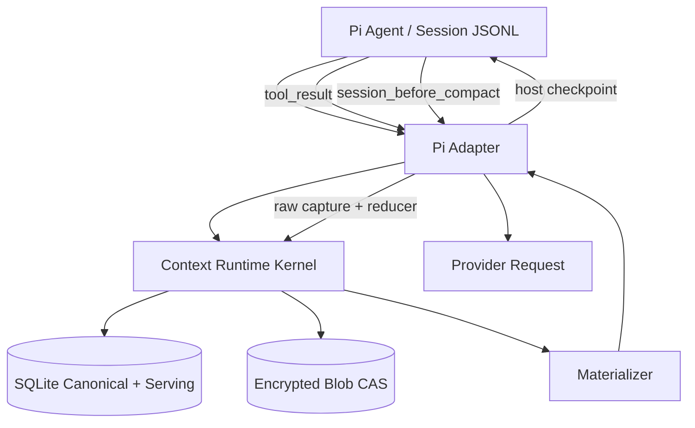

# 目标架构

> 规格版本：`1.0.0`  
> 产品版本：`0.1.0-alpha.1`  
> Pi 基线：`938109e7259068ff736dbba3bed14c81af25abbe` / `@earendil-works/pi-coding-agent@0.84.3`

## 1. 目的

定义宿主无关 Kernel、Pi Adapter、Canonical/Serving Plane、请求路径、写入路径和宿主收敛路径。

## 2. 已冻结决策

- Kernel 不导入 Pi 类型。
- Pi Adapter 是唯一宿主翻译层。
- Pi Session JSONL 与 PCR Store 各有明确事实权威。
- Materialized View 是 request-local，不回写 Pi Session。
- Host Checkpoint 只缩小 Pi 活跃历史，不删除 PCR 原始证据。

## 3. 组件图



## 4. 三条数据路径

### 4.1 Observation Path

```text
Pi tool_result event
→ prepare Saga
→ raw CAS fsync
→ source classification
→ reducer
→ Evidence projection
→ return compact ToolResult
→ Pi message_end persists
→ turn_end acknowledges Saga
```

### 4.2 Request Path

```text
Pi context(messages clone)
→ derive HostSessionCursor
→ active directives/continuity/retrieval
→ preserve exact active-turn suffix
→ allocate I_eff budget
→ render stable/append/volatile/active zones
→ return AgentMessage[]
```

### 4.3 Host Convergence Path

```text
agent_settled / native threshold / overflow
→ deterministic HostCheckpoint candidate
→ session_before_compact returns CompactionResult
→ Pi persists CompactionEntry and rebuilds messages
→ session_compact acknowledges generation
```

## 5. 不变量

1. Canonical raw observation is persisted before reducer output can become host-visible。
2. Active-turn suffix is byte/content equivalent to Pi canonical messages and tool pairing remains valid。
3. Semantic generation cannot block Overflow recovery。

## 6. 验证要求

- 通过与本文对应的任务、Schema、示例和发布门。

## 7. 关联资料

- `diagrams/01-system-architecture.mmd`
- `06-host-agnostic-contracts.md`
