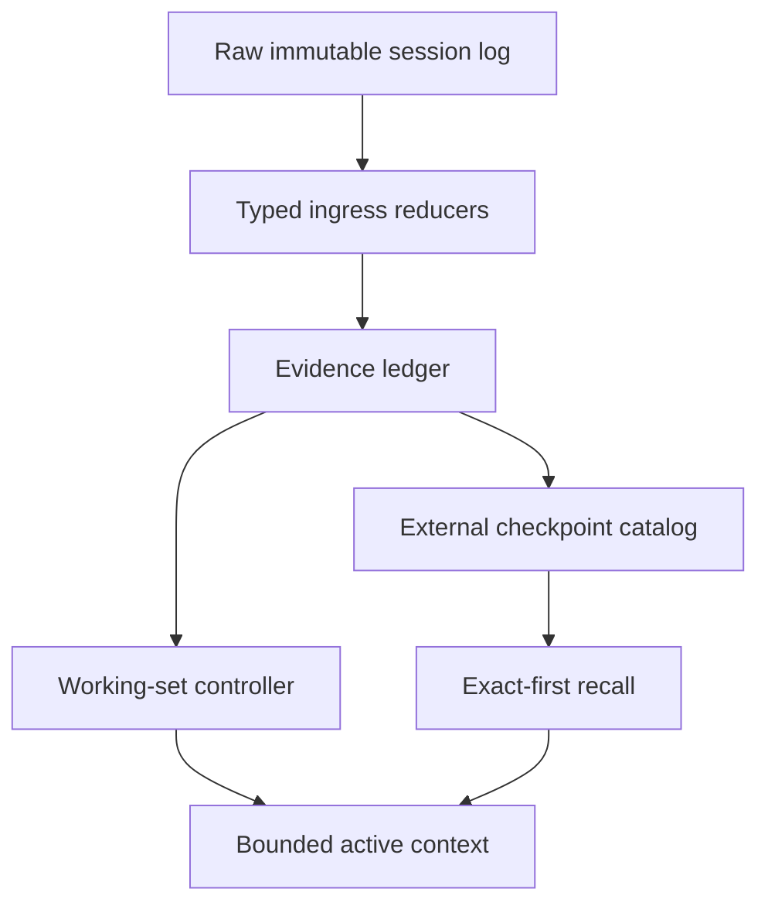

# DSH 上下文压缩设计深度评审与改造建议

> 评审对象：附件 `dsh-compaction-adaptive-design-v1.0.0`（设计包，无实现代码）  
> 评审快照：2026-08-26（Asia/Tokyo）  
> 附件 ZIP SHA-256：`d3faf55c657dbe40888508314c61ec52dbb7b5485ae24c31e7de55135ab7eb`  
> 结论性质：源码审阅、设计推演与文献综合；所有评分均为评审判断，不是附件已有实测结果。

## 1. 执行结论

附件的总体方向是正确的，而且明显优于“到阈值后把旧消息一次性总结掉”的传统方案。它最有价值的三点是：

1. 把 DSH 的不可变 session log 当作事实源，只替换 active surface；
2. 把工具输出降噪、可读索引、语义状态、精确回读拆成不同层；
3. 复用 DSH 已有 generation-bound 多区间 replacement、故障恢复和 replay 语义，而不是另造一套会话存储。

但它现在还不适合按 16 个工作包一次性完整实现。主要问题不是“摘要写得不够好”，而是以下五项基础约束尚未闭合：

- **预算口径不一致**：文档定义了有效输入上限 `A=C-O-G`，触发和目标计算却仍以总窗口 `C` 为分母，可能在大输出预留路由上触发过晚；
- **累计索引没有硬上界**：单个 index 有上限，但所有 frozen index 只告警、不整理，长会话最终仍会被索引淹没；
- **证据验证粒度不够**：实体“出现过”不等于摘要中的关系、状态、时间、否定和因果正确；
- **任务状态过于扁平**：一个 mutable state 很难同时表达 active/parked/superseded 工作面、外部副作用、验证状态和安全的下一步；
- **评测尚不能证明系统复杂度值得**：30 seeds、总召回率和盲评不足以覆盖时间、更新、否定、未知未知、分支任务和压缩时机。

我的建议不是推翻这套设计，而是把它重构成：

> **原始日志是真相；入口只放高信号；工作记忆由证据支持；长期信息默认不占 prompt；召回按需要、按目的、有租约；压缩由有效预算与任务阶段共同触发。**

### 1.1 评审评分

| 维度 | 评分 | 判断 |
|---|---:|---|
| 架构方向 | 8/10 | 分层、可召回、可恢复的方向正确 |
| DSH 兼容性 | 9/10 | 对 replacement/replay/concurrency 约束理解扎实 |
| 安全与故障不变量 | 8/10 | 设计细致，但“零泄漏”门槛缺少可复现语料证明 |
| 记忆保真度 | 6/10 | 有 grounding，但缺 claim-level、时间和更新语义 |
| 长期有界性 | 5/10 | frozen index 的累计增长仍未解决 |
| 成本模型 | 6/10 | 已考虑缓存，但固定 `K=4` 和预算口径仍粗糙 |
| 实证成熟度 | 4/10 | benchmark 是规格，不是结果；社区收益也多为自报 |
| 当前实现就绪度 | 6/10 | 可进入原型，但不建议直接全量生产化 |

**最终判断：Go，但应先做收敛版 M0/M1；不建议按当前设计直接做完整多区域、多层语义系统。**

## 2. 评审范围与方法

本次评审同时核对了：

- 附件中的 24 份设计文档、schema、示例、测试/基准规格和实施计划；
- [DeepSeek Harness](https://github.com/deepseek-ai/deepseek-harness/tree/b150a551b8d465e31e418e1b2eaf5e79bbb7d28e) 的 compaction API、默认 summarizer、replacement transaction、replay/recovery 和 [可召回压缩提案](https://github.com/deepseek-ai/deepseek-harness/blob/b150a551b8d465e31e418e1b2eaf5e79bbb7d28e/.agents/notes/proposed/feature/2026-07-06-recallable-compaction.zh.md)；
- [Pi 原生 compaction 文档](https://github.com/earendil-works/pi/blob/8fa7eebd235355522c8104166b4f1f959b4e2f10/packages/coding-agent/docs/compaction.md) 与 [实现](https://github.com/earendil-works/pi/blob/8fa7eebd235355522c8104166b4f1f959b4e2f10/packages/coding-agent/src/core/compaction/compaction.ts)；
- 社区项目 [pai-acp](https://github.com/ranxianglei/pai-acp/tree/90bcefc400929134ba951d3f1165dee5e2d4acfb)、[pi-smart-compact](https://github.com/alpertarhan/pi-smart-compact/tree/a00a3bb141b41daa3cc210a5a2156f87d9423e1a)、[pi-context](https://github.com/ttttmr/pi-context/tree/7bcce4164ab6a504db9c4ed7b00c3732bffa9048)、[pi-press](https://github.com/sunnyx11/pi-press/tree/90cfad8a118b930e78fdc7f2ae8f700006d246bb)、[Hypa](https://github.com/Hypabolic/Hypa/tree/2678616e62f1f2a8d2ae0904f88859c3f19df860) 和 [dsh-compaction-instant](https://github.com/TsFreddie/dsh-compaction-instant/tree/f6f300fdf2e6841d0f69bf81b8f4c0f69f5241f6)；
- 长上下文、agent memory、压缩时机、主动召回和评测相关论文；
- 当前官方上下文编辑/压缩文档，用于检查工具结果清理、压缩、缓存和持久记忆的边界。

社区项目更新很快，因此本文用固定 commit，而不是只引用 `main`。论文中的数值仅说明其任务上的结果，不能直接当作 DSH 上的预期收益。

## 3. 附件设计重建

附件目标是在 active context 中维持如下结构：

```text
[system/tools]
[seed]
[frozen checkpoint indexes × N]
[latest mutable semantic state]
[recent verbatim tail]
[leased recall results]
```

其信息生命周期分四层：

- **L0：工具特定的确定性编辑**，在进入语义压缩前清理大体积、可恢复的 tool result；
- **L1：确定性 index**，记录来源范围、关键标识符和回读入口；
- **L2：LLM 语义 state**，保存目标、约束、进度、决策、错误和下一步，并做实体 grounding 与 deterministic fallback；
- **L3：literal search/read**，从不可变 log 中精确回读，默认一回合 lease 后移除。

触发策略为 soft 55%、hard 78%、目标 38%，L0 在 32% 后考虑；soft path 还计算未来四轮的缓存调整后收益。压缩通过 DSH replacement transaction 提交，支持准备多个不重叠区间、从左到右提交和部分前缀恢复。

这套方案与 DSH 官方的 proposed recallable compaction 同源：官方提案已经提出“索引 + 最新状态 + 原文尾部 + read/search”的方向，并同时指出 unknown-unknown 和 attention dilution 风险。附件的贡献主要是把该提案补齐为配置、schema、事务、测试、可观测性和 rollout 规格；它仍然是**工程设计包，不是已经经过基准验证的新算法**。

### 3.1 附件自检结果

- 设计包内 52 个 manifest 条目的内容哈希，在把构建机绝对前缀改写为相对路径后全部通过；
- `MANIFEST.sha256` 固化了 `/mnt/data/dsh-compaction-adaptive-design-v1.0.0/...`，因此文档给出的直接校验方式不可移植；
- `scripts/validate_artifacts.py` 依赖 `jsonschema`，但包内没有 requirements/lockfile；本评审环境中脚本因缺少该模块不能直接运行；
- validator 主要检查文件存在、JSON/YAML/schema 形状、Markdown fence 等结构项，不证明算法不变量、跨字段约束或任务质量；
- `config.schema.json` 分别限制 ratio 的取值范围，却没有在 schema 中表达 `target < soft < hard` 等跨字段关系，仍需 runtime semantic validator 和负例测试。

这些是发布工程缺陷，不代表正文哈希损坏，但应在设计包被当作“可直接实现的冻结规格”前修复。

## 4. Pi 原生与社区方案：真正可借鉴的是什么

用户对 Pi 原生逻辑的概括方向正确，但略低估了它。Pi 确实在接近上限时“总结旧上下文 + 保留最近消息”，不过当前实现还会：

- 用 `contextTokens > contextWindow - reserveTokens` 触发，默认预留 16,384 tokens；
- 从后向前选择 cut point，默认保留约 20,000 recent tokens；
- 处理一个超长 turn 被切开的情况，并给摘要加 turn prefix；
- 迭代更新 previous summary，而不是每次从空白重做；
- 用 Goal、Constraints、Progress、Decisions、Next Steps、Critical Context 等结构，并累计文件读写记录；
- 允许 extension 接管 compaction 和 branch summarization。

换言之，Pi 原生不是纯粹的无结构摘要，而是一个“阈值触发、单摘要、最近尾部、可扩展 hook”的可靠基线。它的问题主要是无精确回读、无任务阶段控制、摘要会重复漂移、压缩时可能停顿。

### 4.1 横向比较

| 方案 | 核心选择 | 最值得 DSH 借鉴 | 不应照搬的部分 |
|---|---|---|---|
| Pi 原生 | 阈值后迭代摘要 + recent tail | 简单、可解释、split-turn 与累计文件记录 | 单摘要漂移，无原文 recall |
| pai-acp | 模型主动 `compress`，可 `decompress/search` | 让 agent 参与“何时忘、忘什么”；引用标签和紧急自愈 | 模型元认知不稳定；当前性能/成本数据主要为项目自报 |
| pi-smart-compact | Extract→Explore→Synthesize→Verify | 先确定性取证，再允许模型组织；Continuity Ledger；结果性声明必须有 tool evidence | 跨会话图与全套模式对 DSH v1 过重 |
| pi-context | checkpoint/timeline/branch/handoff | 在阶段边界 compact；active 与 parked 工作面；显式记录磁盘/进程/工单等外部副作用 | 会话分支不等于外部世界回滚，不能当事务系统 |
| Hypa | 在 tool output 进入 prompt 前做确定性 reducer | “垃圾不入场”应成为 L0 主路径；保留原始证据句柄 | 只解决环境观察噪声，不能替代目标/决策/错误的语义记忆 |
| pi-press | 后台预计算 + request-time virtual context | prepared candidate 的完整身份绑定、stale discard、hard path 不等待 | 会增加额外 provider 请求；没有命中率/节省反馈会变成隐性成本 |
| dsh-compaction-instant | 大 checkpoint + literal read/search | 验证了 DSH replacement + recall 的最短实现路径 | checkpoint 上限较大、回读生命周期和长期边界偏弱 |
| 附件方案 | L0/L1/L2/L3 + DSH transaction | 分层最完整，故障与安全规格最好 | 总索引、证据粒度、有效预算与评测尚未闭合 |

### 4.2 对五种“流派”的统一解释

它们并不互斥，而是分别控制不同环节：

| 环节 | 对应思想 | 应回答的问题 |
|---|---|---|
| Ingress | Hypa | 哪些环境噪声根本不应进入工作上下文？ |
| Consolidation | Pi / pi-smart-compact | 哪些历史要变成可执行的连续性状态？ |
| Selection | pai-acp / SelfCompact | 现在是否是安全且划算的压缩时机？ |
| Navigation | pi-context | 当前任务阶段和工作面是什么，哪些只是 parked？ |
| Preparation | pi-press | 能否把摘要计算移出 hard path，且不提交 stale 结果？ |
| Recall | pai-acp / DSH proposal | 需要原文时，如何找回且不永久重新膨胀？ |

因此“最好的压缩是一开始不让垃圾进入”只对 ingress 成立。约束、决定、失败原因、用户更正、外部副作用等信息不是垃圾，却仍会随任务推进失去当前相关性，必须经过 consolidation、selection 和 recall。

## 5. 关键缺口与改造建议

### 5.1 P0：统一有效输入预算，修正触发算法

附件先定义：

```text
A = C - O - G
```

但随后以 `Q/C` 计算 soft/hard 压力，又以 `min(C*targetRatio, A-H)` 计算目标。若 `Q` 已是完整 request input，`A-H` 可能重复扣除 header；更重要的是，按 `C` 触发会忽略输出预留和路由差异。

建议建立唯一 token accounting contract：

```text
I_eff = adapter.effectiveMaxInput ?? (C - O - G)
Q_pred = Q_now + p95(next_step_growth | tool_type, phase)
pressure = Q_pred / I_eff
target = floor(I_eff * targetRatio)
```

- `Q_now` 必须明确是否已经包含 system/tools/cache-read/thinking/tool schema；所有 adapter 只转换一次；
- hard/overflow 由 `Q_pred >= I_eff` 或 provider 实际 overflow 驱动；
- soft 由压力、收益和阶段边界共同驱动；
- 不再从已经是“总输入”的 target 中再次扣 `H`；
- `C`、`I_eff`、`Q_now`、`Q_pred`、每类 token 的来源应写入 telemetry，便于回放。

Anthropic 当前文档也明确区分 context window、输出预算和缓存 token，并指出 prompt caching 只改变成本，不减少窗口占用；因此不能用缓存命中掩盖容量压力。[Context windows](https://platform.claude.com/docs/en/build-with-claude/context-windows)

### 5.2 P0：触发器从“阈值”升级为“预算 × 阶段”

固定阈值的问题不是不够智能，而是可能在推导中段切断局部状态。SelfCompact 的研究显示，“子任务完成/轨迹收敛时 compact，推导中段或卡住时抑制”这一轻量 rubric，与可调用的 compaction tool 组合，优于只给工具或只给规则的版本。[Self-Compacting Language Model Agents](https://arxiv.org/abs/2606.23525)

建议加入确定性优先的 phase gate：

```text
phase ∈ {boundary, converging, mid_derivation, stuck, side_effect_pending}

if overflow or predicted_overflow:
    hard compact; preserve open atomic group and unresolved derivation
elif soft_pressure and positive_benefit:
    compact only at boundary/converging
    otherwise defer up to maxDeferralTurns
```

phase 证据可来自：最近 tool call 是否完成、tests 是否结束、是否仍有未配对 tool pair、assistant 是否声明待验证、是否存在运行中的外部副作用。模型判断只作为 advisory，不能覆盖 hard safety。

### 5.3 P0：从 entity grounding 改为 claim-level evidence

附件当前从输出中提取路径、URL、版本、错误码、数字，检查它们是否出现在历史；然后代码通过字符串/标识符匹配回填 sourceRefs。这能拦一部分“凭空造实体”，却拦不住：

- `test failed` 被压成 `test passed`；
- “不要修改 API”丢失否定词；
- 旧版本约束覆盖了用户刚更新的新约束；
- 数字和文件都出现过，但被配成了错误关系；
- “已修改/已部署”只有 assistant 声称，没有 tool evidence。

近期针对 gist compression 的实验发现，摘要对事实和多跳推理可能有帮助，却会系统性遗漏时间表达；仅在提示中明确要求保留日期/时间，时间表达保留率就从 3.05% 提高到 62.39%，并显著修复时间题。这说明“实体保留”不是充分条件，**时间、极性、有效期和 supersession 必须进入 schema 与评测**。[The Sleeping Agent](https://arxiv.org/abs/2608.11775)

建议采用 pi-smart-compact 风格的 evidence-first pipeline：

1. 代码先把历史提取为 immutable evidence units；
2. 每个 evidence unit 有 `claimId`、`kind`、`polarity`、`validFrom`、`supersededBy`、`sourceSeqSpans`、`toolEvidence`；
3. LLM 只能选择、归并、排序 claim IDs，并生成不引入新具体事实的表述；
4. “已执行/已通过/已部署/已删除”必须引用成功的 tool result 或外部系统证据；
5. validator 检查矛盾、状态跃迁、时间覆盖和来源覆盖，而不是只查字符串出现。

### 5.4 P0：把单一 state 改成 Continuity Ledger

一个任务可能同时存在主线修复、等待中的测试、被用户暂停的重构和已经否定的方案。附件的一个 latest state 很容易把它们压扁。

建议 state 至少包含：

```yaml
task_fronts:
  active: []
  parked: []
  completed: []
  superseded: []
constraints: []
decisions: []
unresolved_errors: []
external_side_effects: []
validation_state: []
changed_artifacts: []
next_safe_action: []
evidence_refs: []
```

每项都有 stable ID、source span、状态、时间、依赖和 supersession。`next_safe_action` 不能只是“下一步做什么”，还要说明从哪里继续、先验证什么、什么动作不可重复。pi-context 对外部副作用的警告尤其重要：conversation checkpoint 不能回滚文件系统、进程、浏览器、工单或数据库，因此这些状态必须显式进入 ledger。[pi-context](https://github.com/ttttmr/pi-context/tree/7bcce4164ab6a504db9c4ed7b00c3732bffa9048)

### 5.5 P0：给 frozen index 总量设硬边界

附件把旧 index 冻结以保护 cache prefix，这对短中会话合理；但 v1 达到 `maxIndexRatio` 只报警，不整理。长期结果必然是：index 本身挤占工作区，而且大量中间位置的 stub 继续制造注意力稀释。长上下文研究早已表明，模型对中间位置的信息利用并不稳定。[Lost in the Middle](https://arxiv.org/abs/2307.03172)

建议不要把所有 checkpoint stub 永久放在 prompt：

- 完整 checkpoint catalog 保存在 prompt 外，仍由不可变 log 和内容哈希校验；
- prompt 中只放一个有上限的 directory 摘要，以及当前 task fronts 相关的 top-k index；
- 旧 index 合并为稳定的二级目录，保留 child refs，不复制全量 `sourceSeqs`；
- `sourceSeqs: number[]` 改为压缩的连续 spans + exceptions + coverage hash，避免 checkpoint metadata 随会话线性膨胀；
- 目录重建必须可从 log 确定性恢复，并测试 cycle、缺子节点、hash mismatch、schema migration。

这不是要求首版实现复杂向量数据库。SQLite FTS/BM25 或简单倒排目录已经足够；关键是**模型可见目录有硬预算，完整目录可精确恢复**。

### 5.6 P0/P1：保留 exact-first，但补 unknown-unknown

literal search 很安全，适合路径、错误码、命令、commit 和用户原话；它却无法处理“之前那个缓存问题”“用户后来改过的限制”这类同义、时间或关系查询。DSH 官方提案也承认 recall 必须由 agent 学会触发，unknown-unknown 是核心风险。

建议采用分级召回，而不是直接上 vector DB：

1. stable ID / seq / checkpoint 精确读取；
2. literal、path、error、command、symbol 搜索；
3. 本地 FTS/BM25、trigram 和时间过滤；
4. 只有前三层低置信度时，才做 query expansion 或可选 embedding；
5. 检索结果以 evidence unit 返回，并携带来源、时间和不可信内容标签。

[LongMemEval](https://arxiv.org/abs/2410.10813) 把长期记忆拆成 indexing、retrieval、reading，并发现事实增强 key 与 time-aware query expansion 有价值；它还要求覆盖信息抽取、多 session 推理、时间推理、知识更新和拒答。这些维度应成为 DSH recall benchmark 的最低集合。

一回合 recall lease 也过于机械。更合理的是 `purpose-bound lease`：只要 ledger 中仍有依赖该证据的 unresolved action 就续租；任务面完成、证据被新工具结果替代或达到 token cap 时释放。主动、选择性提醒比 passive bank 或 always-on injection 更有效的研究结果，也支持“必要时注入、无缺口时保持沉默”。[Remember When It Matters](https://arxiv.org/abs/2607.08716)

### 5.7 P0：把 Hypa 式 ingress shaping 提升为首发主线

附件已有 L0，但目前更像语义压缩前的优化。建议把它变成独立产品面：

- 工具返回 `compact view + raw evidence handle + reducer revision + content hash`；
- 按 tool/schema 设计 reducer，而不是主要依赖中英文关键词；
- diff 保留 hunk header、改动范围、失败项和统计；测试日志保留失败测试、首尾关键信号和完整日志句柄；搜索结果去重并保留命中位置；
- reducer 失败时回退原文，不得静默丢弃；
- raw evidence 永不经过 LLM 后再落盘，避免摘要污染事实源。

这与当前官方建议把 tool result clearing、compaction 和 durable memory 分开处理相吻合：[Context editing](https://platform.claude.com/docs/en/build-with-claude/context-editing) 负责移除已完成使命的旧工具结果，[Compaction](https://platform.claude.com/docs/en/build-with-claude/compaction) 管理长会话摘要，而 memory 保存必须跨摘要存活的状态。

### 5.8 P1：吸收 pi-press，但让后台压缩成为可取消缓存

附件已经考虑 prepared candidate，但身份约束和收益反馈还不够完整。建议 candidate key 至少绑定：

```text
sessionId + generation/epoch + sourceLeaf + sourceRanges
+ routedModel + tokenizerRevision + system/tools hash
+ reducer/compiler revision + summary schema version + config fingerprint
```

后台只 `prepare`，不 commit；任何新消息、路由变化、配置变化或来源 replacement 都使 candidate stale。hard path 永不等待后台任务，失败直接走 deterministic compiler。记录 prepared hit rate、stale rate、额外 summary token、节省的前台延迟和每次成功任务的净成本；否则“用户无感”可能只是把延迟换成了隐藏账单。pi-press 的设计提供了很好的 candidate identity 与 virtual projection 参考。[pi-press DESIGN](https://github.com/sunnyx11/pi-press/blob/90cfad8a118b930e78fdc7f2ae8f700006d246bb/docs/DESIGN.md)

### 5.9 P1/P2：成本策略从固定 K 变成可校准控制器

附件 soft path 假设未来 `K=4` 轮，适合作为初始 heuristic，但不同任务阶段、provider cache TTL、cache write/read 价格和工具输出增长差异很大。

建议先按 route/provider/phase 记录预测与实际：

```text
realized_net_value =
  avoided_input_cost
  + avoided_overflow_cost
  - summary_cost
  - cache_rewrite_cost
  - recall_cost
  - quality_regression_cost
```

M1 用分桶校准和保守阈值；积累足够失败轨迹后，再考虑 ACON 式“用 full-context 成功、compressed-context 失败的配对轨迹更新压缩指南”，而不是一开始就训练复杂策略。[ACON](https://arxiv.org/abs/2510.00615) 和 [Active Context Curation](https://arxiv.org/abs/2604.11462) 支持 task-aware/learned curator 的长期方向，但这些结果不能替代 DSH 自己的消融实验。

### 5.10 P0：降低首发事务复杂度

DSH 的 generation-bound replacement 很强，附件的多区域 left-to-right 提交也考虑得很完整；问题是，首版同时引入多区间规划、index/state 两种 checkpoint、父子 lineage、回读 lease 和 background candidate，会扩大故障状态空间。

建议 M1 只支持：

- 一个 eligible contiguous prefix；
- 一个 composite checkpoint（内部包含 bounded index + continuity ledger）；
- recent atomic tail；
- exact read/search；
- 一次 generation-bound replacement；
- deterministic fallback。

先用 fault injection 证明 crash/replay/重复提交/并发推进不变量，再通过 ablation 证明 frozen multi-region 对缓存和质量有显著净收益。若无显著收益，就没有必要为架构美感支付状态机成本。

## 6. 推荐目标架构



模型每轮实际看到的 active context 建议为：

```text
[stable system/tools or on-demand tool schemas]
[typed task seed / pinned constraints within a hard budget]
[one bounded directory]
[one evidence-grounded continuity ledger]
[recent atomic tail]
[purpose-bound recalled evidence]
```

这里的“记忆”不是一个单独摘要，而是六类具有不同生命周期的对象：

| 记忆类型 | 事实源 | 是否常驻 prompt | 写入方式 | 读取方式 |
|---|---|---:|---|---|
| Episodic trace | immutable session log | 否 | 原始事件 | seq/checkpoint read |
| Environmental evidence | raw tool results / handles | 否 | 确定性 | exact/FTS search |
| Working memory | continuity ledger | 是，有硬上限 | 证据选择 + 状态机 | 直接读取 |
| Semantic memory | facts/constraints/decisions | 仅 active subset | claim-level consolidation | directory + recall |
| Procedural memory | reducer/policy/config | system/plugin | 版本化代码 | route/config |
| External-world state | file/process/ticket/db refs | 只放状态与句柄 | 工具证据 | 原系统验证 |

这也回答了“Agent 记忆到底是什么”：它不是“把历史记住”，而是一个持续运行的控制系统，负责**写入什么、什么常驻、何时合并、何时遗忘、如何恢复、什么必须再次验证**。

## 7. 评测与发布门槛重构

附件现有 benchmark 已经覆盖 transaction、成本、recall 和故障注入，是不错的起点；仍需从“摘要质量测试”升级成“长期任务结果测试”。

### 7.1 测试矩阵

| 维度 | 必测场景 |
|---|---|
| 事实类型 | 目标、约束、否定、数字、时间、顺序、更新、已作废事实 |
| 工作面 | active、parked、恢复、分支、目标切换、用户纠正 |
| 工具链 | 大输出、重复搜索、失败→诊断→修复、运行中进程、异步结果 |
| 召回 | exact、同义、关系、时间范围、未知未知、应拒答 |
| 事务 | stale generation、部分提交、崩溃重放、重复事件、schema 升级 |
| 安全 | prompt injection、secret 变体、编码/分片 secret、恶意 log、权限边界 |
| 经济性 | cache hit/miss、不同 provider、后台候选命中/过期、recall 回涨 |

外部基准至少接入：

- [ToolHaystack](https://arxiv.org/abs/2505.23662)：多目标、噪声、目标切换和缺失上下文的长期 tool use；
- [LoCoEval](https://arxiv.org/abs/2603.06358)：仓库开发中的迭代需求、噪声输入和回溯问题；
- [MemGym](https://arxiv.org/abs/2605.20833)：把 memory 质量与执行器推理/工具能力分离，覆盖编码、研究、工具对话和 computer use；
- LongMemEval 的 temporal/update/abstention 子集；
- DSH 自己采样并脱敏的真实长轨迹，带 oracle evidence 与最终任务断言。

### 7.2 主要指标

- **任务质量**：pass@1、关键约束召回、continuation correctness、outcome-claim precision、时间/更新/否定 F1、矛盾率、应拒答准确率；
- **记忆行为**：需要时 recall 的比例、不需要时保持沉默的比例、relevant evidence rank、lease token-turns、重复召回；
- **系统安全**：orphan tool pair、越权/secret/reasoning 泄漏、不可恢复 checkpoint、replay divergence；
- **效率**：峰值 active tokens、累计 input/output/cache tokens、p50/p95 latency、后台额外调用、cost per successful task；
- **退化分解**：compressor error、retrieval error、reader error、executor error 分开报告。

### 7.3 统计规则

- 用相同轨迹/seed 做 paired comparison，并报告 bootstrap 95% CI；
- 对任务成功采用预先定义的 non-inferiority margin，而不是只比较平均值；
- 30 seeds 可做早期信号，但不足以支持“99%/100%”高置信结论；
- “零 secret leak”应被定义为版本化攻击语料上的 release gate，并持续 fuzz，而不是被解释为现实中的绝对保证；
- blind grader 需要固定 rubric、交叉评分或确定性 assertions，报告分歧率；
- 必须有 ablation：无 L0、无 semantic state、无 recall、无 phase gate、无 directory、无 background prepare。

## 8. 分阶段实施路线

### M0：测量与可复现性（1–2 周）

- 修复 relative manifest、依赖 lock 和 CI validator；
- 统一 token accounting，建立 per-request/phase/cost telemetry；
- 回放 DSH official、instant、Pi-like baseline，冻结首批真实 workload；
- 先实现跨字段 config validator 和负例测试。

**退出条件**：同一 trace 的 token、replacement、replay 结果可确定性重现。

### M1：收敛版安全压缩（2–4 周）

- typed ingress reducers；
- evidence units + continuity ledger；
- 单 contiguous prefix、单 composite checkpoint；
- recent atomic tail；
- exact read/search + deterministic fallback；
- 有效预算 + phase gate。

**退出条件**：任务质量对最佳简单基线非劣；crash/replay/并发不变量全通过；每次成功压缩严格缩小 active context。

### M2：有界目录与选择性召回（2–4 周）

- prompt-external catalog、bounded visible directory；
- FTS/BM25 + 时间过滤；
- purpose-bound lease 与 proactive gap detector；
- 时间、更新、否定、abstention 专项评测。

**退出条件**：长会话 index 不再线性占满 prompt，recall 带来正的 task-adjusted net value。

### M3：延迟与成本优化（按数据决定）

- pi-press 式 prepared candidates；
- provider/cache-aware realized feedback；
- multi-region/frozen layout 消融；
- 只有出现足够 paired failures 后才做 ACON 式 guideline tuning 或 curator 训练。

**退出条件**：后台额外成本、stale churn 和多区域复杂度都被可测收益覆盖。

### M4：可选的跨 session/项目记忆

这是与 v1 会话内压缩不同的产品面。需要项目隔离、权限、保留期、删除、审计和用户控制，不应通过扩大 v1 checkpoint schema 顺手实现。

## 9. 对附件实施计划的具体修改清单

### 必须在编码前修改

1. 全文将压力和目标从 `C` 迁移到统一 `I_eff`；
2. 明确 `Q` 是否含 `H`，删除潜在的二次扣减；
3. `sourceSeqs[]` 改为 span 编码并增加 coverage/hash 不变量；
4. 将 entity grounding 改为 claim/evidence contract；
5. state schema 增加 task fronts、时间、极性、supersession、external side effects 和 validation state；
6. frozen index 增加总硬预算与 prompt-external catalog；
7. soft trigger 增加 phase gate，hard trigger 增加 next-step growth prediction；
8. lease 从固定回合数改为目的/依赖驱动，并保留绝对 token/TTL cap；
9. `maxSearchMillis` 若在同步 JS 全量扫描中实现，必须改用 worker/chunked async/可取消查询，否则 wall-clock 上限只是配置愿望；
10. manifest 使用相对路径，并提供锁定的 validator 依赖。

### 建议从首发移后

- 多区域 left-to-right commit；
- 完整目录 DAG；
- embedding/vector DB；
- 学习型 compressor/curator；
- 跨 session 记忆图；
- 自动在线调权。

## 10. 最终建议

如果目标是尽快在 DSH 上获得一个可生产验证的方案，我会选择：

> **Hypa 式入口确定性降噪 + pi-smart-compact 式证据/连续性账本 + pi-context 式阶段边界 + DSH 原子 replacement/不可变 log + pai-acp 式按需回读 + pi-press 式可取消预计算。**

但组合原则不是把六个项目的功能全部搬进来，而是让每个机制只负责一个清晰问题，并保持三条硬边界：

1. **真相与提示分离**：raw log/evidence 不因 prompt 压缩而丢失；
2. **状态与检索分离**：当前工作状态常驻，历史证据按需进入；
3. **安全与智能分离**：容量、事务、来源、权限由确定性代码保证，模型只参与语义选择与组织。

附件已经具备一个高质量设计包的骨架。最值得投入的下一步，不是继续扩写文档或增加更多摘要层，而是先修正预算/索引/证据三项基础模型，用最小实现跑出 paired、可回放、面向任务成功的基准结果。只有这些结果证明收益后，多区域 frozen cache、后台预测和学习型 memory policy 才值得继续复杂化。

## 11. 主要参考资料

### 实现与官方文档

- [DeepSeek Harness：固定评审 commit](https://github.com/deepseek-ai/deepseek-harness/tree/b150a551b8d465e31e418e1b2eaf5e79bbb7d28e)
- [DeepSeek Harness：可召回压缩提案](https://github.com/deepseek-ai/deepseek-harness/blob/b150a551b8d465e31e418e1b2eaf5e79bbb7d28e/.agents/notes/proposed/feature/2026-07-06-recallable-compaction.zh.md)
- [Pi：Compaction 文档](https://github.com/earendil-works/pi/blob/8fa7eebd235355522c8104166b4f1f959b4e2f10/packages/coding-agent/docs/compaction.md)
- [Pi：Compaction 源码](https://github.com/earendil-works/pi/blob/8fa7eebd235355522c8104166b4f1f959b4e2f10/packages/coding-agent/src/core/compaction/compaction.ts)
- [pai-acp](https://github.com/ranxianglei/pai-acp/tree/90bcefc400929134ba951d3f1165dee5e2d4acfb)
- [pi-smart-compact](https://github.com/alpertarhan/pi-smart-compact/tree/a00a3bb141b41daa3cc210a5a2156f87d9423e1a)
- [pi-context](https://github.com/ttttmr/pi-context/tree/7bcce4164ab6a504db9c4ed7b00c3732bffa9048)
- [pi-press](https://github.com/sunnyx11/pi-press/tree/90cfad8a118b930e78fdc7f2ae8f700006d246bb)
- [Hypa](https://github.com/Hypabolic/Hypa/tree/2678616e62f1f2a8d2ae0904f88859c3f19df860)
- [dsh-compaction-instant](https://github.com/TsFreddie/dsh-compaction-instant/tree/f6f300fdf2e6841d0f69bf81b8f4c0f69f5241f6)
- [Anthropic：Context editing](https://platform.claude.com/docs/en/build-with-claude/context-editing)
- [Anthropic：Server-side compaction](https://platform.claude.com/docs/en/build-with-claude/compaction)
- [Anthropic：Context windows](https://platform.claude.com/docs/en/build-with-claude/context-windows)

### 论文与基准

- [Lost in the Middle](https://arxiv.org/abs/2307.03172)
- [LongMemEval](https://arxiv.org/abs/2410.10813)
- [ToolHaystack](https://arxiv.org/abs/2505.23662)
- [ACON](https://arxiv.org/abs/2510.00615)
- [Self-Compacting Language Model Agents](https://arxiv.org/abs/2606.23525)
- [ACM: Agentic Context Management](https://arxiv.org/abs/2607.23809)
- [Active Context Curation](https://arxiv.org/abs/2604.11462)
- [Remember When It Matters](https://arxiv.org/abs/2607.08716)
- [The Sleeping Agent](https://arxiv.org/abs/2608.11775)
- [MemGym](https://arxiv.org/abs/2605.20833)
- [LoCoEval](https://arxiv.org/abs/2603.06358)

