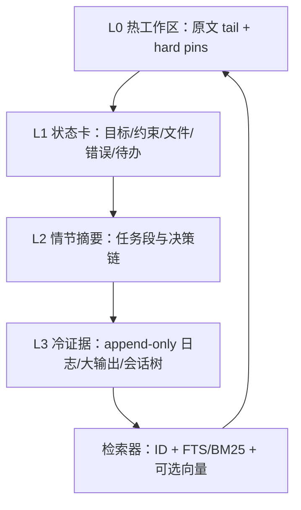
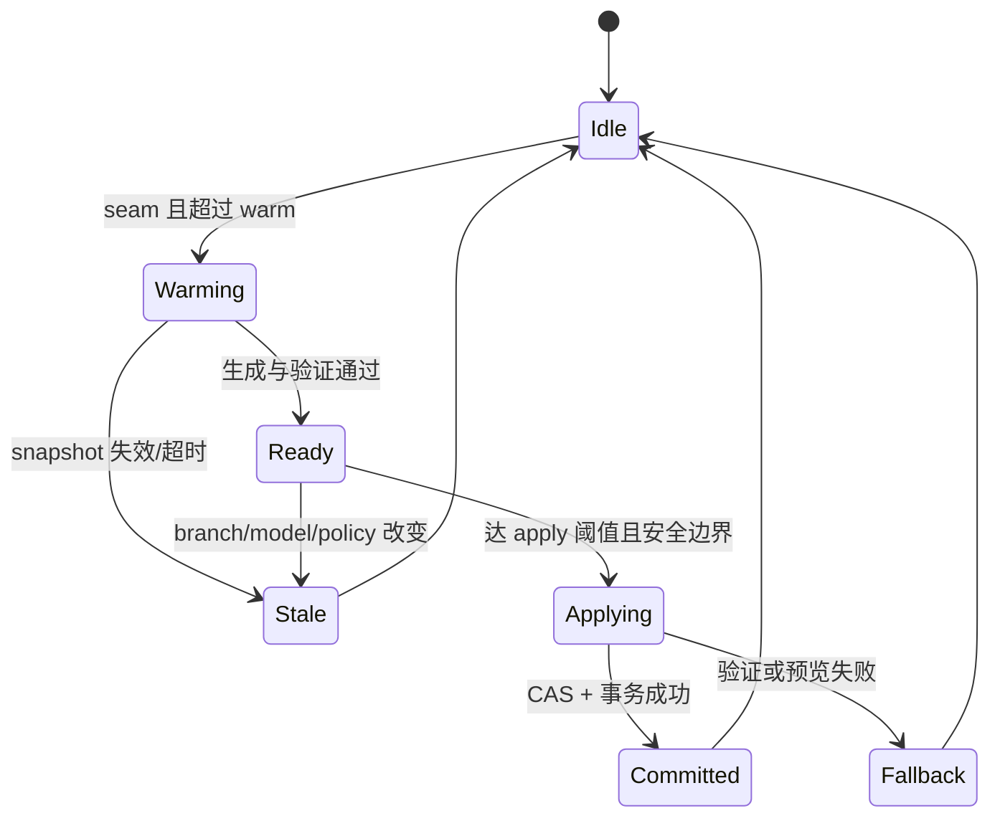

# DeepSeek Harness 与 Pi 生态上下文压缩：源码级综合调研与改进方案

> 研究日期：2026-08-26（Asia/Tokyo）  
> 研究对象：DeepSeek Harness、dsh-compaction-instant、Pi 原生 compaction、billion-context-pi（原 pai-acp）、pi-smart-compact、pi-context、Hypa，以及用户所称“pi-press”的提前预压缩机制。  
> 结论依据：GitHub 源码与维护者文档、官方产品文档、论文原文。项目自报 benchmark 与独立证据分开标注。

## 摘要

上下文压缩并不是一个单纯的“把旧聊天总结短一点”的问题，而是一个**受预算约束的 Agent 状态迁移问题**：系统要从完整、可审计的历史状态，构造一个较小的工作状态；这个工作状态既要让模型继续正确执行，又要能在信息被遗漏时回到证据原文，并且不能在并发、崩溃或边界切分时破坏会话。

本次源码调研的核心结论如下。

1. **DeepSeek Harness 提供了目前这组方案中最稳健的“提交底座”**：append-only 事件日志、可重建 surface、带 start/summary/end 事件的事务、崩溃检测、overflow 恢复、工具调用边界保护和 KV 前缀复用都设计得很扎实。但默认压缩仍是一次 LLM 生成的单体 Markdown 摘要，长期递归压缩会产生语义漂移；默认 tool-result pruner 只是 head + marker + tail，缺少语义选择与主动召回。
2. **dsh-compaction-instant 把“生成式摘要”替换为确定性编译**：速度快、可重复、不消耗摘要模型调用，并用序号、search、recall 把原始日志变成冷存储。它所谓“近无损”指的是**原文仍可检索**，不是“模型当前看到的 checkpoint 无损”。其活跃表示会截断文本、丢弃 tool result 正文并默认丢弃 reasoning；恢复依赖模型主动检索。
3. **Pi 原生 compaction 简洁、合理但功能边界清晰**：按 token 压力触发，保留最近窗口，支持 split-turn、递归更新上次摘要，并额外保留读写文件列表。它没有证据级验证、历史检索和可逆恢复，重复 compaction 会把旧摘要再次交给模型重写。
4. **Pi 社区方案分别优化不同维度，而不是互相替代**：
   - billion-context-pi / 原 pai-acp：让模型主动选择何时、压哪些范围，并提供分层 block、search、decompress；强在“主动记忆管理”，弱在依赖模型自觉和插件状态复杂度。
   - pi-smart-compact：先确定性抽取事实，再探索、综合、验证，能拒绝有缺口的摘要；是这组方案中质量门最完整的，但成本、实现复杂度和延迟也最高。
   - pi-context：把会话树当作可 checkpoint、可分支、可回看的历史；强在可逆和人为可控，弱在总结仍由 Agent 自己写，并不自动解决 token 压力。
   - Hypa：在 bash/MCP 输出进入上下文前就做本地、确定性减噪；它是**预防层**，不是会话压缩器。
   - “pi-press”：截至调研日未检索到可核验的同名公开仓库。用户描述的“提前生成摘要、到阈值直接切换”与 [`pi-async-compaction`](https://github.com/almogdepaz/pi-async-compaction) 的源码机制吻合，因此本文以该项目作为可审计代表，并明确标注此名称映射。
5. **更好的方案不是在上述方案里选一个，而是把它们组合成一个分层、可验证、可恢复的记忆系统**：
   - Hypa 式入口减噪；
   - DeepSeek Harness 式 append-only 日志与事务提交；
   - instant 式确定性 capsule、指针和 recall；
   - Smart Compact 式事实抽取与证据门；
   - ACP 式主动选择和多级 memory block；
   - pi-context 式 checkpoint/timeline；
   - async compaction 式后台预计算与 generation fence。

本文把该方案命名为 **HACM（Hierarchical Auditable Context Memory，分层可审计上下文记忆）**。其关键区别是：**不把摘要当成唯一记忆，也不把“压缩率”当成唯一目标**；摘要只是带证据引用的一个派生视图，原始事件、结构化状态卡和外部工作区状态共同构成 Agent 记忆。

---

## 1. 调研范围、方法与可信度

### 1.1 证据策略

本报告优先级如下：

1. 运行时源码、测试、配置与事件协议；
2. 同仓库设计文档和 README；
3. 官方平台文档；
4. 论文原文；
5. 二手文章只用于发现线索，不用于断言实现事实。

检索阶段通过 Exa 执行了 26 个查询，审阅 230 条候选结果；去重后，将实现结论收敛到 GitHub 一手源码、官方文档和论文。项目 README 中的性能数字均标为“项目自报”，没有当作跨项目公平 benchmark。

### 1.2 名称与版本消歧

| 用户称呼 | 本报告核验对象 | 说明 |
|---|---|---|
| DeepSeek Harness | [`deepseek-ai/deepseek-harness`](https://github.com/deepseek-ai/deepseek-harness) | 默认分支 `master` |
| dsh-compaction-instant | [`TsFreddie/dsh-compaction-instant`](https://github.com/TsFreddie/dsh-compaction-instant) | DeepSeek Harness compaction 后端替代实现 |
| Pi | [`earendil-works/pi`](https://github.com/earendil-works/pi) | 旧链接可能指向 `badlogic/pi-mono`；仓库已迁移 |
| pai-acp | [`ranxianglei/billion-context-pi`](https://github.com/ranxianglei/billion-context-pi) + [`ranxianglei/acp-kernel`](https://github.com/ranxianglei/acp-kernel) | 项目已更名/拆分；本文把旧名和当前实现关联起来 |
| pi-smart-compact | [`alpertarhan/pi-smart-compact`](https://github.com/alpertarhan/pi-smart-compact) | EESV 管线 |
| pi-context | [`ttttmr/pi-context`](https://github.com/ttttmr/pi-context) | 不是同名零星 fork |
| Hypa | [`Hypabolic/Hypa`](https://github.com/Hypabolic/Hypa) | 对应 Pi 包位于 `packages/pi-hypa` |
| pi-press | 未找到可核验同名仓库 | 以 [`almogdepaz/pi-async-compaction`](https://github.com/almogdepaz/pi-async-compaction) 代表用户描述的机制；另有 [`pi-preemptive-compact`](https://github.com/SannaMarcoDev/pi-preemptive-compact)，但实现规模与可审计材料更少 |

### 1.3 如何理解“无损”

讨论上下文压缩时，至少要拆开五种不同的“保留”：

| 层级 | 问题 | instant 等方案的真实含义 |
|---|---|---|
| 原始持久化 | 原始消息还在不在磁盘/日志里？ | 通常在 |
| 活跃表示 | 当前 prompt 是否仍含逐字原文？ | 通常不在 |
| 可寻址性 | 是否有稳定 ID 指回原始证据？ | instant 有 seq；普通摘要通常没有 |
| 可检索性 | 模型是否有 search/recall 工具？ | instant、ACP、Smart Recall 有不同程度支持 |
| 行为等价性 | 压缩后 Agent 是否还会做出同样正确的下一步？ | 没有任何方案能天然保证 |

因此，“日志仍在”不能直接推出“压缩无损”；“能搜索”也不能推出“模型会在正确时机搜索”。真正要优化的是最后一层：**压缩后继续执行的成功率和稳定性**。

---

## 2. 统一分析框架：上下文压缩到底在压什么

Agent 上下文至少包含六类信息，它们的保留策略应当不同。

| 信息类型 | 示例 | 合理策略 |
|---|---|---|
| 当前控制状态 | 用户最新目标、约束、权限、待办、下一步 | 热区原文 + 结构化 hard pin |
| 环境事实 | 文件路径、commit、测试结果、错误文本、ID、端口 | 精确保留或带证据指针的状态卡 |
| 因果历史 | 为什么选择方案 A、A 失败后改成 B | 结构化决策/错误链，不宜只保留结论 |
| 大体积观察 | build log、搜索结果、文件全文、MCP schema | 入口减噪 + 冷存原文 + 可检索摘要 |
| 临时推理 | 已失效假设、重复尝试、冗长 reasoning | 默认不保留；只提取可验证结论和失败原因 |
| 长期语义记忆 | 项目约定、用户确认偏好、常用流程 | 独立、可编辑、按项目隔离的 memory store |

从算法视角，现有方案主要落在两类：

- **Selection（选择）**：保留一部分原文、删除其余，例如 tail retention、tool-result pruning。
- **Generation（生成）**：生成一个原文中未必出现的短表示，例如 LLM 摘要或确定性编译 checkpoint。

2026 年的预印本 [Context Compaction Theory](https://arxiv.org/abs/2608.01326) 用通信复杂度形式化了这两类策略，并证明某些查询上 generation 能以比 selection 更小的预算完成任务。这支持一个重要工程判断：**只做原文筛选不够，只做自由摘要也不稳；应组合确定性选择、结构化生成和按需检索**。

---

## 3. DeepSeek Harness：最值得保留的是事务语义，不只是摘要 Prompt

### 3.1 架构位置

DeepSeek Harness 把 compaction 设计成一个可替换能力，而不是硬编码在 agent loop 内。核心说明见 [`docs/subsystems/compaction.zh.md`](https://github.com/deepseek-ai/deepseek-harness/blob/master/docs/subsystems/compaction.zh.md) 和 [`compaction-basic`](https://github.com/deepseek-ai/deepseek-harness/tree/master/packages/compaction/compaction-basic)。

关键抽象是：

- **append-only session log**：权威历史，不就地删除；
- **surface**：从事件派生出来、实际喂给模型的可变视图；
- **compaction provider**：实现 `compactIfNeeded`、`compactNow`、`compactRegion`；
- **consumer**：如 `/compact` 命令只依赖 capability，不绑定具体算法。

这意味着压缩不是“删历史”，而是**用一个较小的派生消息替换 surface 上的旧区间**，原始事件仍可用于回放和审计。

### 3.2 触发与恢复

默认策略来自 [`config.ts`](https://github.com/deepseek-ai/deepseek-harness/blob/master/packages/compaction/compaction-basic/src/config.ts)：

- `thresholdRatio = 0.8`；
- `retainRatio = 0.16`；
- `maxSummaryOutputTokens = 8192`；
- 自动压力检查默认启用；
- compaction 与 overflow retry 默认各 1 次；
- 支持 provider/model 精确覆盖，也支持用 `retainTokens` 替代比例。

有两条自动路径：

1. `agent/pre-step` 在调用模型前按压力主动 compact；
2. `agent/request-error` 捕获上下文溢出；只有 surface replacement generation 确实推进后才重试，避免无限 retry。

### 3.3 安全切分

[`region.ts`](https://github.com/deepseek-ai/deepseek-harness/blob/master/packages/compaction/compaction-basic/src/region.ts) 从旧消息前缀中选择压缩区间，按 token 预算保留最近 tail；如果切点破坏 tool call/tool result 配对，就回退或调整边界。它不强制保留完整“用户大回合”，所以一个超大 turn 中已经闭合的早期步骤也可被压缩，这比只按 user turn 切更灵活。

### 3.4 摘要生成与 KV cache

[`summarizer.ts`](https://github.com/deepseek-ai/deepseek-harness/blob/master/packages/compaction/compaction-basic/src/summarizer.ts) 的一个优秀细节是：它重放原请求的 system prompt、工具 schema 和待压缩消息，把 compaction instruction 放在最后一个 user message。这样大段前缀与之前请求完全一致，有机会复用 provider KV/prompt cache。

摘要 Prompt 要求保留：主任务、关键技术概念、文件与代码、错误与修复、待办、当前工作、下一步和关键上下文；要求保留精确路径、命令、错误、ID 与数字。旧 checkpoint 会作为输入让模型“合并更新”，而不是机械拼接。

输出门包括：

- 必须是文本；图片或无文本输出失败；
- 因 max-token 截断失败关闭；
- 估算后的摘要必须小于被替换区间，否则拒绝。

### 3.5 事务和崩溃一致性

核心流程可概括为：

```text
append compaction/start
  → 生成摘要
  → 重新验证待替换 surface
  → append compaction/summary
  → surface replace
  → append compaction/end
```

`start / summary / end` 是日志事件，真正进入模型的是带 `surfaceOp: replace` 的合成 user message。未匹配的 `start` 可用于检测中途崩溃。这个协议比“直接改 messages 数组”可靠得多，也是后续改进算法最应该复用的部分。

### 3.6 tool-result pruner

可选的 [`compaction-tool-result-pruner`](https://github.com/deepseek-ai/deepseek-harness/tree/master/packages/compaction/compaction-tool-result-pruner) 只有在压力/overflow 已满足时运行；它先对大 tool result 做确定性 head + marker + tail，再重新计量，如果已经降到阈值下就不调用摘要模型。

默认按 Unicode code point 计数：阈值 8192，保留头 4096、尾 1024。优点是便宜、稳定、原文仍在 append-only log；缺点是它并不知道“哪几行是错误根因”，也不是模型 tokenizer 的 token-aware 策略，甚至可能切在 grapheme cluster 中间。

### 3.7 评价

**优势**

- 事务、崩溃恢复、overflow 重试和 surface generation fence 完整；
- append-only 原始日志便于审计；
- compaction capability 可替换；
- 工具配对和摘要缩减门可靠；
- 摘要请求的 KV 前缀复用意识优秀。

**风险**

- 单体自由文本摘要没有字段级证据引用；
- 每次把上一次摘要再交给模型合并，长期会产生“摘要沉积”和语义漂移；
- pruner 只看长度和首尾，不看任务价值；
- 原始日志虽在，但没有默认暴露 search/recall 给模型；
- 压缩仍有一次同步 LLM 延迟。

结论：**DeepSeek Harness 是优秀的 compaction transaction framework，但还不是完整的 Agent memory system。**

---

## 4. dsh-compaction-instant：把历史编译成可寻址 checkpoint

### 4.1 它替换了什么

[`dsh-compaction-instant`](https://github.com/TsFreddie/dsh-compaction-instant) 保留 DeepSeek Harness 的 start/summary/end 和 surface replacement 协议，只替换“如何生成摘要”。其核心在 [`compiler.js`](https://github.com/TsFreddie/dsh-compaction-instant/blob/main/src/compiler.js)、[`region.js`](https://github.com/TsFreddie/dsh-compaction-instant/blob/main/src/region.js)、[`recall.js`](https://github.com/TsFreddie/dsh-compaction-instant/blob/main/src/recall.js) 和 [`search.js`](https://github.com/TsFreddie/dsh-compaction-instant/blob/main/src/search.js)。

它不用 LLM，而是把可压缩消息编译成一个 VCC 风格 checkpoint。

### 4.2 区间选择

默认 `thresholdRatio = 0.5`，保留最近 1 个 turn，且 recent tail 有 5120 token 硬上限。实现先尽量保留完整最近 turn；如果最新 turn 自己就过大，则退化为保留节点后缀；最后仍执行 tool call/result 配对守卫。

这与 DSH basic 的差异是：

- DSH 以 token tail 为主，允许跨 turn 压缩；
- instant 优先保留最近完整 turn，再受 token ceiling 约束。

### 4.3 编译规则

默认编译大致执行：

1. 过滤 ANSI/control 字符；
2. 为原始消息分配顺序 `seq`；
3. user/assistant 文本按单条预算截断，附原始 source marker；
4. tool call 折叠为一行，只保留白名单关键参数和 result 指针；
5. tool result 正文不进入 checkpoint，只留下可 recall 的序号；
6. reasoning 默认不包含；
7. 图片/文档只变成引用标记；
8. 上一轮 checkpoint 作为系统块保留，再受总 checkpoint cap 约束。

默认 `checkpointCap = 65536`，assistant 文本单条约 512 token、user 文本约 1024、tool call 约 128。超过总 cap 时，先多轮缩小文本预算；仍超限则优先删除较老的 result/tool/media/note 行，再删更老的其他条目，必要时硬截最后内容。

### 4.4 recall 与 search

checkpoint 内置 recall 指南，并注册两类恢复工具：

- 按 seq、范围、tool result 或 checkpoint ordinal 恢复；
- 按关键词或正则搜索完整 append-only log。

recall 通过 session event 派生原始消息，因此能返回被 checkpoint 省略的原文；但 recall 输出自身仍受默认约 16000 token 预算和 span 限制。search 是线性扫描日志的词法检索，不是语义检索。

### 4.5 “近无损”的准确解释

该项目 README 的自报 benchmark 展示了很高压缩率，尤其当 tool output 占主导时；但这不应理解为活跃上下文无损：

- 文本会截断；
- tool result 正文被移出；
- reasoning 默认丢弃；
- checkpoint cap 下会删除老条目；
- 能否恢复取决于 Agent 是否意识到信息缺失并主动 search/recall。

它真正提供的是**可审计的外存式近无损**：原文留在日志，活跃上下文是有损索引。

### 4.6 评价

**优势**

- 零摘要模型调用，延迟低、成本稳定、结果可重复；
- 避免自由文本摘要幻觉；
- 每条历史有稳定指针，能精确 recall；
- 直接复用 DSH 的事务协议。

**风险**

- 纯词法、纯规则，不知道哪些事实对当前任务更重要；
- 老记录在 cap 压力下主要按类别和时间删除；
- recall 是被动的，模型不知道自己忘了什么时不会搜索；
- 线性日志搜索随会话增长；模型生成的正则需要超时/复杂度保护；
- 自定义 tokenizer 与实际 provider token meter 可能偏差。

结论：**instant 是很好的 L0/L1“编译与外存”层，但不应单独承担高语义密度的长期状态压缩。**

---

## 5. Pi 原生 compaction：一个干净的递归摘要基线

Pi 的设计文档见 [`compaction.md`](https://github.com/earendil-works/pi/blob/main/packages/coding-agent/docs/compaction.md)，核心实现在 [`compaction.ts`](https://github.com/earendil-works/pi/blob/main/packages/coding-agent/src/core/compaction/compaction.ts) 和 [`utils.ts`](https://github.com/earendil-works/pi/blob/main/packages/coding-agent/src/core/compaction/utils.ts)。

### 5.1 默认策略

- `reserveTokens = 16384`；
- `keepRecentTokens = 20000`；
- 当 `contextTokens > contextWindow - reserveTokens` 自动触发；
- 最近一次 assistant usage 可作为实际 token 基准，尾部缺失 usage 时用字符估算。

切点从后向前寻找，允许 user、assistant、bash、custom、branch summary、compaction summary 等边界，但不切在 tool result 上。若一个 turn 太大，Pi 支持 split-turn：对较早 prefix 单独总结，再与历史摘要合并，保留后半段 raw tail。

### 5.2 摘要语义

Pi 的摘要格式关注：Goal、Constraints、Progress（Done/In Progress/Blocked）、Key Decisions、Next Steps、Critical Context。它把消息序列化成带 role 标签的普通文本，避免摘要模型继续扮演对话；tool result 在摘要输入中会截到约 2000 字符。

重复 compaction 时，Pi 将上次 summary 与新增历史一起更新，而不是从最初完整日志重算。它还累积 `readFiles`、`modifiedFiles`，以标签追加到 summary，弥补通用摘要容易遗漏路径的问题。

### 5.3 扩展面

`session_before_compact` 可取消 compaction 或返回自定义 `CompactionResult`；触发原因区分 manual、threshold、overflow，成功/失败也有事件。这正是 Smart Compact 和 async compaction 能接管行为的基础。

### 5.4 评价

Pi 原生方案的价值是**简单、边界正确、可扩展**。缺点是自由文本摘要没有证据门；tool result 在送入摘要前就截断；没有 recall/search；递归更新摘要会积累丢失。它适合作为可靠 fallback，而不是最终记忆架构。

---

## 6. Pi 社区五条路线

### 6.1 billion-context-pi / 原 pai-acp：让 Agent 主动遗忘

当前实现由 [`billion-context-pi`](https://github.com/ranxianglei/billion-context-pi) 适配 Pi，状态内核在 [`acp-kernel`](https://github.com/ranxianglei/acp-kernel)。它在每次 LLM 调用的 `context` 阶段重写可见消息，并取消 Pi 原生自动 compaction，避免两个 owner 同时修改上下文。

核心思路：为消息加 `<acp>` 引用，让主 Agent 自己调用 `compress`，选择历史范围和摘要内容；需要时可 `search_context`、`decompress`、查看状态或委派压缩。

内核将压缩块记录为带 `blockId`、run、tier、topic、summary、直接/有效消息 ID、嵌套块和 generation 的结构。多级 block 会像 LSM 一样继续蒸馏/合并；最近用户消息和软热区受保护，特定工具可硬排除。增长阈值到达时系统通过推荐/nudge 提醒模型主动压缩，并有紧急截断兜底。

**强项**

- 压缩时机可以落在语义边界，而不是固定 token 点；
- Agent 可选择“忘哪段”、可搜索压缩块；
- 分层 block 比单体摘要更接近长期记忆。

**风险**

- 模型可能不压、压错范围或写错摘要；论文 [Self-Compacting Language Model Agents](https://arxiv.org/abs/2606.23525) 也发现，仅给 compaction tool 并不足够，需要明确 rubric 才能稳定使用；
- visible ref、提示词、工具调用会占上下文和回合；
- block 多级合并仍可能递归失真；
- Pi 缺少 handler priority 时，多个 context/compaction 扩展可能互相覆盖；
- “decompress”能恢复结构化 block，但不宜在没有逐字原文证据的情况下宣称行为级无损。

适合：研究型、超长会话、愿意让 Agent 管理自身记忆的环境。生产使用应加入 deterministic trigger、证据引用和失败兜底。

### 6.2 pi-smart-compact：先抽取事实，再允许模型写摘要

[`pi-smart-compact`](https://github.com/alpertarhan/pi-smart-compact) 的核心原则是 **Facts first, synthesis second, verification before apply**。详见 [`ARCHITECTURE.md`](https://github.com/alpertarhan/pi-smart-compact/blob/main/ARCHITECTURE.md)。

它的 EESV 管线为：

1. **Extract**：零 LLM 调用，确定性抽取 modified/read/deleted files、错误及修复信号、决策、约束、主题、时间线、目标和 open loops；
2. **Explore**：只在 thorough 或高风险 auto 模式中运行，模型通过有限工具查看消息区间、搜索、错误链、文件变更，最多有限轮次；
3. **Synthesize**：按规模选择零调用 deterministic、single-pass 或分层 chunk → batch summary → assemble；
4. **Verify**：对抽取事实、continuity、focus/note 和源消息做结构化校验。

验证范围包括路径遗漏、未解决错误、约束、目标、结构、虚构路径、done/unresolved 冲突、关键决策、open loops 和高风险成功声明。比如“tests passed”只有在源消息或匹配的成功 test tool result 中找到证据才成立；read/search 工具返回的“测试通过”文字不能证明测试真的执行成功。

修复顺序非常值得借鉴：

1. 确定性、幂等 patch；
2. 只有 thorough 模式允许一次 LLM patch；
3. 若仍不可靠，改用只由 extraction、continuity 和用户 steering 生成的 deterministic quality floor；
4. 最终仍有 gap 就拒绝，保持会话不变。

它还要求规划前后都满足目标窗口和至少 10% 净节省；pending summary 有 session/branch/TTL 约束；真正持久化要等匹配的 `session_compact`。成功压缩会写入按项目隔离的 SQLite FTS5 context graph，`smart_recall` 可检索目标、决策、约束、错误、open loop、文件和关键上下文；另有需要用户确认的显式长期 memory。

**强项**

- 当前方案中最完整的事实抽取、验证、修复和 fail-closed 质量门；
- 结构化 continuity ledger 减少任务措辞变化导致的遗忘；
- 项目隔离 recall、secret/PII scrub、备份权限、damage feedback 和 metrics 比较成熟；
- 大 tool result 在完整抽取后才为 synthesis prompt 截断，顺序正确。

**风险**

- 模块多、状态面大，集成和维护成本高；
- thorough 路径会有 explore、分层 synthesis、可选 LLM repair，多次模型调用；
- 规则抽取本身会有语言、工具命名和路径语义的 coverage 上限；
- 与其他接管 `session_before_compact` 或会话树的扩展仍需协调唯一 owner。

结论：**Smart Compact 最接近“可验证 compaction”，其质量门应成为新算法的核心，而不是照搬其全部复杂度。**

### 6.3 pi-context：会话历史的 checkpoint、timeline 与分支

[`pi-context`](https://github.com/ttttmr/pi-context) 在 `/acm` 激活后给 Agent 三个工具：

- `context_checkpoint`：给当前或目标 history node 加语义标签；
- `context_timeline`：查看 root/head/checkpoint/branch/user turn/summary 的结构图；
- `context_compact`：指定回退目标，并由 Agent 提供 handoff summary，可选创建备份 checkpoint。

实际压缩是 `branchWithSummary(target, enrichedSummary)`，然后切到新分支继续；老分支仍在 Pi session tree 中，可以无损回看。实现会等待 idle，并在请求发出后检查 conversation 是否前进，避免把过期 compact 应用到新状态。

需要特别强调：它管理的是**会话树，不是 Git 工作区**。切回旧 conversation branch 不会回滚已修改文件、数据库、网络请求或部署。因此 handoff summary 必须记录外部副作用。

**强项**：可逆、可人工检查、能在语义 seam 主动 checkpoint；特别适合探索多个路线。  
**风险**：没有自动 token policy；summary 由当前 Agent 写入 tool argument；恢复旧信息需要主动浏览树；外部状态不回滚。

### 6.4 Hypa：最便宜的 token 是从未进入上下文的 token

[`Hypa`](https://github.com/Hypabolic/Hypa) 的 Pi 集成见 [`packages/pi-hypa`](https://github.com/Hypabolic/Hypa/tree/main/packages/pi-hypa)。它不是聊天历史 compactor，而是 tool-output hygiene 层。

对 bash 调用，Hypa 本地执行 `hypa rewrite --json`：可能重写为更精确的过滤命令、放行、询问、拒绝，失败时 fail-open。它还提供压缩版 shell/read/grep/find/ls，优先保留 error、warning、changed files、failed tests 和 exit code。过大结果按约 50 KB / 2000 行限制，完整被截结果可写临时文件恢复。MCP proxy 则把大量上游工具 schema 改成一个紧凑 discovery 工具，按需加载 schema。

**强项**：本地、确定性、零 LLM；在污染发生前减少 tool output 和 schema；对编码 Agent 的收益通常比事后重写一大段日志更直接。  
**风险**：命令重写本身要有语义/安全测试；fail-open 时仍会膨胀；临时文件不是长期记忆；对普通对话、推理和非 Hypa 工具的历史无能为力。

结论：**Hypa 应放在任何 compaction 方案之前，但不能替代 compaction。**

### 6.5 “pi-press”/提前预压缩：隐藏等待，不改变摘要质量

截至 2026-08-26，GitHub repository 搜索和 Web 精确检索均未发现可核验的 `pi-press` 同名实现。用户描述与 [`pi-async-compaction`](https://github.com/almogdepaz/pi-async-compaction) 一致：超过一个较早阈值后，在后台调用 Pi 原生 compaction 逻辑生成摘要；到安全边界再把 ready result 交给 Pi。

其状态机是：

```text
idle → pending → ready → idle
           ↘ stale | failed
```

默认后台 start ratio 为 0.8，可配置为更早的 0.5；只有在 `floor(window × ratio) < tokens <= window - reserveTokens` 的窗口内自动启动。后台 job snapshot 包含 session、leaf、first-kept、model、thinking level、settings 和 prompt version。

apply 前会验证：

- session/model/thinking/settings 未变化；
- first-kept 与 snapshot 一致且不是 toolResult；
- snapshot leaf 与 first-kept 仍在当前 branch 且顺序正确；
- 新增消息可作为 raw tail 接在摘要后；
- 预览后的上下文仍低于 `contextWindow - reserveTokens`；
- 自定义 `/compact <instructions>` 不复用旧摘要。

通常只在 idle 且没有 queued messages 时触发 `ctx.compact()`；如果当前 turn 可 abort、没有 queued 消息且已超 async 阈值，可先 abort，compact 持久化成功后自动发送 `continue`。模型、thinking、tree navigation、shutdown 等会让 pending/ready job 失效；验证失败时 Pi 回退同步 compaction。

**强项**：把等待移到后台，复用 Pi 原生 split-turn、旧摘要合并和文件标签语义；snapshot fence 比“生成完就替换”安全。  
**风险**：摘要质量与 Pi 原生相同，只优化时延；pending/ready 只在内存，重启即丢；只有一个 job；本地镜像 Pi 未导出的 preparation 逻辑，存在版本漂移；默认 0.8 可能太晚，复杂摘要未必在阈值前完成。

结论：**异步化是正交能力：它解决停顿，不解决遗忘。**

---

## 7. 综合对比

### 7.1 机制矩阵

| 方案 | 主要触发 | 压缩对象 | 选择方式 | 活跃表示 | 原文恢复 | 质量验证 | 并发/提交 | 主要代价 |
|---|---|---|---|---|---|---|---|---|
| DSH basic | 80% 压力/overflow/manual | 旧消息前缀 | token tail + tool pair | LLM Markdown 摘要 + raw tail | 日志在，但默认无 recall | 文本、长度、缩减门 | 强：事务事件 + generation fence | 1 次同步 LLM |
| DSH instant | 默认 50%/manual | 旧前缀/turn | recency + cap + tool pair | 确定性 seq checkpoint | 强：seq recall + search | 结构/长度门，无语义门 | 复用 DSH 强事务 | 低延迟；额外 recall 回合 |
| Pi 原生 | `window-reserve`/overflow/manual | 旧 branch 前缀 | keepRecent + safe cut | 递归 LLM 摘要 + raw tail | 无内置 recall | 输出失败门，无证据门 | host hook/entry | 1 次同步 LLM |
| billion-context-pi | Agent 主动 + nudge + emergency | Agent 选定范围/block | 模型选择 + 分层规则 | 多级 block summaries | search/decompress block | 主要靠模型与内核约束 | 状态复杂；需唯一 owner | 工具回合 + 模型注意力 |
| Smart Compact | 压力/manual/tool | 规划后的旧前缀 | deterministic window + 风险自适应 | 经验证结构化 Markdown + ledger | SQLite FTS5 + backup/restore | **最强：抽取、修复、零 gap** | pending/commit/TTL/provenance | 最高实现与模型成本 |
| pi-context | Agent/manual seam | 选定会话树前缀 | checkpoint/target | Agent handoff summary + 新分支 | 强：旧 branch 在树中 | 无自动语义验证 | idle 与 branch advance guard | 依赖 Agent 纪律 |
| Hypa | 每次 tool call 前 | 工具命令、输出、schema | 本地规则/重写 | 精简 tool evidence | 临时文件/原工具 | 规则级 | fail-open | 少量本地开销 |
| async/“pi-press”机制 | 较早比例 + safe idle | Pi 原生压缩前缀 | 复用 Pi | 预生成 Pi 摘要 | 同 Pi | 同 Pi；多 snapshot 验证 | 强：pending/ready/stale fence | 后台 LLM；可能浪费 stale job |

### 7.2 工程评分（1 低，5 高）

> 这是基于源码能力的工程判断，不是统一 benchmark。复杂度一列的 5 表示最复杂，不代表更好。

| 方案 | 语义保真 | 确定性 | 可恢复 | 低停顿 | 长期扩展 | 复杂度 |
|---|---:|---:|---:|---:|---:|---:|
| DSH basic | 3 | 2 | 2 | 2 | 3 | 3 |
| DSH instant | 3 | 5 | 5 | 5 | 4 | 3 |
| Pi 原生 | 3 | 2 | 1 | 2 | 2 | 2 |
| billion-context-pi | 4 | 2 | 4 | 3 | 5 | 5 |
| Smart Compact | 5 | 4 | 4 | 2–3 | 5 | 5 |
| pi-context | 3 | 3 | 5 | 4 | 3 | 3 |
| Hypa | 仅入口 | 5 | 3 | 5 | 3 | 3 |
| async/“pi-press”机制 | 同底层 compactor | 同底层 | 同底层 | 5 | 3 | 4 |

### 7.3 谁解决了什么

- 如果痛点是**压缩时卡住**：async compaction 最直接；instant 更彻底地取消摘要调用。
- 如果痛点是**摘要漏文件、错报测试通过**：Smart Compact 的 deterministic extraction + verification 最强。
- 如果痛点是**压完后想找回原文**：instant 的 seq recall 或 pi-context 的 branch 更直观。
- 如果痛点是**tool output 占满窗口**：Hypa 应先上；事后 compaction 是第二道防线。
- 如果痛点是**超长、多主题、模型应自己决定遗忘**：ACP 的分层主动 memory 最有启发，但要加 trigger 和证据兜底。
- 如果要做一个**平台级基础设施**：DSH 的 event-sourced surface transaction 是最佳底座。

### 7.4 为什么单体摘要会越来越差

重复 compaction 通常执行：

```text
summaryₙ₊₁ = LLM(summaryₙ + new_history)
```

每一轮都可能：省略低频精确事实、把推测写成结论、丢失否定词、混淆已完成与待完成、合并两个相似路径。旧事实只剩上轮摘要可见时，下一轮无法回到证据纠正，误差会积累。

[Acon](https://arxiv.org/abs/2510.00615) 的实验方向表明，Agent context 是动态 world state，通用摘要规则容易漏掉动作—观察关系、前置条件和后续决策线索；它通过失败轨迹优化压缩指南，在所测任务中同时减少 token 和提高成功率。更新的预印本 [TRACE](https://arxiv.org/abs/2608.06503) 进一步指出，压缩即使保留了显著实体，也可能削弱“Agent 当前走到哪一步”的可执行性，诱发重复探索和 blocked action。两者共同说明：**摘要质量必须用压缩后的行为来评估，而不是只看文本是否像一份好总结。**

---

## 8. 更好的方案：HACM 分层可审计上下文记忆

### 8.1 目标与不变量

HACM 的目标不是最大压缩率，而是在固定窗口下最小化：

\[
L = \alpha \cdot \text{执行失败} + \beta \cdot \text{关键事实遗漏} + \gamma \cdot \text{停顿} + \delta \cdot \text{token 成本} + \epsilon \cdot \text{不可恢复风险}
\]

必须满足以下不变量：

1. 原始事件 append-only，压缩只修改派生 surface；
2. 最新用户目标、权限/约束、未完成事项、未提交修改、失败测试与工具配对不得静默丢失；
3. 每个生成事实都有 source event refs，或明确标注为 inference；
4. 压缩结果必须比替换内容显著更小；
5. 后台结果只能在同 session/branch/model/policy generation 上 CAS 应用；
6. 任何验证失败都回退到确定性 capsule，不把未验证摘要提交；
7. 原文可按 ID/范围检索，模型也能被策略自动提示召回；
8. reasoning 默认不持久化，秘密在 provider、索引和落盘边界前 scrub。

### 8.2 四层记忆，而不是一个 summary



- **L0 Hot**：最近 12k–20k token 原文；最新用户消息、正在执行的 tool pair、关键错误上下文硬固定。
- **L1 State Cards**：小而精确的结构化卡片，持续更新，不递归重写整份摘要。
- **L2 Episodes**：按任务/阶段组织的语义摘要，记录因果、决策与结果；低频注入，按需检索。
- **L3 Evidence Store**：完整事件日志、tool output blob、checkpoint branch、文件/测试外部状态；不默认塞进 prompt。

这与 [MemGPT](https://arxiv.org/abs/2310.08560) 的虚拟上下文/分层存储思想一致，但针对编码 Agent 增加了 tool pair、文件变更、错误链、事务和证据验证。

### 8.3 入口减噪：先阻止垃圾进入

借鉴 Hypa，在工具层统一实施 Observation Budget：

1. tool result 到达时先完整写入 L3 blob，计算 checksum；
2. 确定性抽取 exit code、error/warning、changed paths、test summary、关键匹配行；
3. 活跃消息只放“头/关键窗口/尾 + blob ref”，不是盲目 head/tail；
4. schema 使用按需 discovery，避免所有 MCP schema 常驻；
5. 用户可配置 `verbatimTools` 和 `protectedPatterns`；
6. 压缩器不能执行 tool output 内的指令，避免 prompt injection 通过 memory 固化。

优先级：错误附近窗口 > 成功/失败摘要 > 修改路径 > 命中行 > 头尾 > 重复进度噪声。

### 8.4 原子单元和安全边界

将历史规范化为 `ContextAtom`，而不是直接处理 message 字符串：

```ts
type ContextAtom = {
  id: string;                 // 稳定 event/seq id
  role: "user" | "assistant" | "tool" | "system";
  kind: "goal" | "constraint" | "decision" | "action" |
        "observation" | "error" | "file" | "todo" | "text";
  tokenCost: number;
  refs: string[];             // toolCallId、path、errorId、episodeId
  recoverability: "verbatim" | "blob" | "reconstructable";
  timestamp: number;
};
```

边界算法先把 tool call + result、连续错误—修复—验证、用户需求变更组成不可拆 `AtomicGroup`。切点只落在 group 之间；若单组过大，正文移 L3，L0 保留结构化证据和 ref。

### 8.5 保留评分：规则负责底线，模型只做补充

候选组的效用分：

\[
U_i = w_rR_i + w_gG_i + w_dD_i + w_uU_i + w_fF_i + w_eE_i + w_pP_i + w_xX_i - w_bB_i - w_sS_i
\]

含义：

- `R` recency；
- `G` 与当前目标相关；
- `D` 关键决策/因果；
- `U` unresolved/open loop；
- `F` 文件或外部状态变更；
- `E` 错误、失败测试和验证证据；
- `P` 用户强调/显式 pin；
- `X` 精确且不可轻易重建（ID、命令、数字、权限）；
- `B` 体积且可从 blob/文件重读；
- `S` 重复或已被更新状态 supersede。

hard pins 不参与普通排序：最新用户请求、当前计划、未完成 side effect、未解决错误、最新测试结论、权限边界、tool pair 和用户 pin 必须保留。其余在 token budget 下做近似 knapsack，并加入 diversity 约束，避免所有预算都被同一文件或同一错误占满。

### 8.6 状态卡：避免整份摘要反复重写

每个卡片是独立、可版本化的事实单元：

```ts
type MemoryCard = {
  cardId: string;
  type: "goal" | "constraint" | "decision" | "file-state" |
        "error" | "validation" | "open-loop" | "next-action";
  value: unknown;
  status: "active" | "resolved" | "superseded" | "uncertain";
  sourceRefs: string[];
  confidence: number;
  generation: number;
  supersedes?: string[];
  expiresWhen?: string;
};
```

新一轮压缩不是 `rewrite(summary)`，而是：

```text
extract delta cards
→ match existing card identity
→ append new version
→ mark old version superseded/resolved
→ render active cards to checkpoint view
```

这样一个路径或约束不会因为整篇摘要重写而悄悄改字；resolved error 也不会立刻消失，而是保留一段 continuity horizon。

### 8.7 两阶段生成与证据门

模型只处理确定性抽取无法表达的内容：目标归纳、因果解释、决策理由、episode 合并。输出必须是 typed JSON，再渲染成 Markdown：

```json
{
  "goal": [{"text": "...", "refs": ["e17"]}],
  "constraints": [{"text": "...", "polarity": "must_not", "refs": ["e4"]}],
  "decisions": [{"decision": "...", "reason": "...", "refs": ["e31", "e35"]}],
  "progress": {"done": [], "active": [], "blocked": []},
  "files": [{"path": "src/x.ts", "operation": "modified", "refs": ["e80"]}],
  "errors": [{"id": "err-7", "status": "unresolved", "refs": ["e92"]}],
  "openLoops": [],
  "nextAction": {"text": "...", "refs": ["e101"]}
}
```

验证顺序：

1. schema、token、shrink、引用存在性；
2. tool pair/hard pin/路径 collision 检查；
3. polarity 与状态迁移检查；
4. 高风险结果必须由成功工具证据支持；assistant 自述不能证明自己测试通过；
5. 对生成性因果声明做小模型/critic entailment，但 critic 不能覆盖 deterministic failure；
6. deterministic patch；
7. 仍有 gap 时退化为 deterministic cards + capsule；不提交自由摘要。

这保留 Smart Compact 的“事实先行、验证后应用”，但把可更新信息拆成 cards，减少每轮全量 EESV 的成本。

### 8.8 后台预计算与安全应用

建议分四档触发，而不是单一 80%：

| 阶段 | 建议初值 | 动作 |
|---|---:|---|
| Hygiene | 每次 tool result | 入口减噪、blob 化、delta extraction |
| Warm | 45% | 在完整 turn/任务 seam 后后台生成候选 episode/cards |
| Prune | 55% | 确定性删除已 blob 化的大输出与重复 access |
| Apply | 68% | 若 ready 且验证通过，安全边界 CAS 提交 |
| Emergency | `window - reserve` / overflow | 同步 deterministic fallback；必要时再小模型摘要 |

比例应按模型窗口、生成速度和会话增长率自适应：

\[
t_{lead} \ge P95(t_{summary}) + P95(t_{verify}) + safetyMargin
\]

即预测距离 overflow 的剩余时间必须大于后台工作 P95，而不是固定“到 80% 才开始”。



snapshot 至少包含：session ID、surface generation、prefix end event ID、retained-tail start ID、model key、tool schema hash、policy/config hash、prompt version、workspace state hash（可选）。应用时只允许 prefix 之后追加了可保留 raw tail；任何 branch reorder、model/policy/schema 改变都使结果 stale。

### 8.9 自动召回：不能只给工具，还要知道何时用

提供 `context_search`、`context_recall`、`context_timeline`、`context_pin/unpin`：

- ID/range recall 返回逐字原文；
- FTS5/BM25 搜索卡片、episode 和原始事件；
- 可选 embedding 只用于召回候选，不作为事实证据；
- timeline 展示 checkpoint、branch、compaction lineage；
- recall 输出受 budget、secret policy 和权限控制。

另外在每个新顶层 user turn 前构造一个轻量 recall query：当前目标词、正在编辑路径、未解决 error ID、最近工具名。只有检索高分且不在 L0 的卡片才注入，默认 1k–3k token，避免“有检索系统但模型从不想起使用”。

自动召回必须有防抖：同一证据在 N 个 turn 内不重复注入；低置信结果只给引用，不当作事实；与最新状态冲突时保留两个版本和时间关系，不做静默 latest-wins。

### 8.10 事务提交

HACM 在 DSH 上复用其协议，并扩充 manifest：

```text
compaction/start(snapshot, policyHash)
→ write cards/episodes/index as uncommitted generation g
→ verify candidate + preview post-surface tokens
→ compaction/summary(manifest, refs, verifierReport)
→ CAS surface replace if generation unchanged
→ compaction/end(g, checksum)
→ mark memory generation committed
```

若崩溃发生在 `end` 前，启动时根据 event log 和 checksum 回滚未提交 memory generation；原始事件不丢。若 surface 已换但索引落盘部分失败，可从 summary manifest 和原始日志重建。

### 8.11 伪代码

```ts
async function maybeCompact(ctx: AgentContext): Promise<Result> {
  const usage = meter(ctx.surface);
  await ingestNewEvents(ctx);              // blob + deterministic delta extraction

  if (usage.ratio >= cfg.warmRatio && atSemanticSeam(ctx)) {
    background.ensure(snapshot(ctx), buildVerifiedCandidate);
  }

  if (usage.ratio >= cfg.pruneRatio) {
    const pruned = deterministicObservationPrune(ctx.surface);
    if (meter(pruned).ratio < cfg.applyRatio) return commitSurfaceOnly(pruned);
  }

  if (usage.ratio < cfg.applyRatio) return { kind: "noop" };

  const ready = background.getValid(snapshot(ctx));
  const candidate = ready ?? deterministicFallback(ctx);
  const checked = verify(candidate, evidenceStore, hardPins(ctx));

  if (!checked.ok) {
    if (!ctx.isOverflow) return { kind: "rejected", gaps: checked.gapKinds };
    return commitTransaction(deterministicEmergency(ctx));
  }

  if (!previewFits(checked.output, ctx.retainedTail, cfg.reserveTokens)) {
    return commitTransaction(deterministicEmergency(ctx));
  }

  return commitTransactionCAS(ctx.surfaceGeneration, checked.output);
}
```

### 8.12 建议配置

```json
{
  "hygiene": {
    "maxVisibleToolTokens": 3000,
    "keepErrorWindows": 6,
    "blobAllToolResultsAboveTokens": 2000,
    "scrubSecrets": true
  },
  "pressure": {
    "warmRatio": 0.45,
    "pruneRatio": 0.55,
    "applyRatio": 0.68,
    "reserveTokens": 16384,
    "hotTailTokens": 16000
  },
  "checkpoint": {
    "maxTokens": 12000,
    "minNetSavingRatio": 0.15,
    "resolvedContinuityGenerations": 2
  },
  "retrieval": {
    "autoBudgetTokens": 2000,
    "maxRecallTokens": 16000,
    "lexical": true,
    "embeddings": false
  },
  "verification": {
    "requireRefs": true,
    "rejectUnsupportedOutcomes": true,
    "llmCritic": "risk-only",
    "failClosed": true
  }
}
```

这些是起始值，不应硬编码。窗口小于 64k 时改用绝对 token；生成慢的模型更早 warm；工具密集会话提高 hygiene 强度；纯文本讨论降低 blob 规则、提高 episode budget。

---

## 9. 在 DeepSeek Harness 上的实现方案

### 9.1 包结构

建议以 DSH 为主平台实现，因为它已有最强的 surface transaction：

```text
packages/
  compaction/compaction-hacm/       # ctx.compaction provider、策略与事务协调
  compaction/context-ledger/        # cards、episodes、lineage、SQLite/FTS
  compaction/tool-output-gate/      # Hypa 式入口减噪与 blob store
  compaction/context-retrieval/     # search/recall/timeline/pin tools
  compaction/compaction-worker/     # 可选后台生成与 verifier worker
```

不建议只继承 basic engine 并 override `summarize()`：这样无法完整改变区间选择、入口减噪、异步生命周期和检索注入。应实现新的 `ctx.compaction` provider，同时复用/上游抽取 DSH 的 tool pairing、checkpoint source、token meter 和 transaction helper。

### 9.2 最小可用版本（MVP）

MVP 先不做 embedding 和 Agent 主动压缩：

1. append-only event refs + SQLite FTS；
2. tool result blob + semantic windows；
3. instant 风格 deterministic capsule；
4. structured cards：goal、constraint、file、error、open loop、validation；
5. `context_search` / `context_recall`；
6. DSH 原事务 + shrink gate；
7. 关键事实 zero-gap verifier。

这一版即使不调用摘要模型，也比纯 instant 多“状态卡和自动召回”，比 DSH basic 多“可恢复证据”。

### 9.3 第二阶段

- 引入小模型生成 episode/decision reason；
- typed JSON + evidence refs；
- deterministic patch + risk-only critic；
- 旧 card 版本化，而非递归摘要；
- 完整 failure taxonomy 和 metrics。

### 9.4 第三阶段

- 后台 warm/ready/stale 状态机；
- 按生成速度/上下文增长率预测 lead time；
- safe seam rubric：子任务结束、测试完成、方案收敛时优先；mid-tool/mid-derivation 抑制；
- Agent 主动 `compact_episode`，但 deterministic pressure policy 仍是最终 owner。

### 9.5 Pi 适配

Pi 版本可以复用 `session_before_compact` 返回 `CompactionResult`，并使用 `session_compact` 作为 durable commit authority。后台生命周期可基于 `pi-async-compaction/core` adapter；timeline/branch 可与 pi-context 思想对齐。但必须避免多个扩展同时拥有：

- `session_before_compact`；
- `context` rewrite；
- branch mutation。

推荐提供一个统一 orchestrator，其他扩展只作为 hygiene、retrieval 或 summarizer adapter 接入。

---

## 10. 评测：不能只测压缩率

### 10.1 核心指标

| 维度 | 指标 |
|---|---|
| 任务质量 | compaction 后任务成功率、SWE-bench/Terminal 类 Pass@1、resume 成功率 |
| 状态保持 | goal/constraint/file/error/open-loop/decision recall；否定词与状态极性准确率 |
| 执行稳定 | 重复 tool call、重复读文件、blocked action、已完成步骤重做、过早终止 |
| 可恢复 | 指定历史事实的 search recall@k、逐字恢复成功率、引用命中率 |
| 成本 | 活跃 token、摘要输入/输出 token、额外 recall token、KV cache hit/write |
| 延迟 | compaction pause P50/P95、后台完成率、ready 命中率、stale 浪费率 |
| 安全 | secret 泄漏、prompt injection 固化、跨项目检索、权限越界 |
| 健壮 | crash recovery、重复事件、单超大 turn、孤儿 tool result、branch 切换 |

### 10.2 对比实验

至少运行这些基线：

1. 无 compaction（在窗口允许的短轨迹上作为 oracle）；
2. DSH basic / Pi native；
3. instant；
4. Smart Compact；
5. HACM deterministic-only；
6. HACM + semantic episodes；
7. HACM + background + auto recall。

每个 compaction boundary 保存同一环境状态，分别从压缩前和压缩后启动闭环 continuation，测量新增重复行为和 blocked action。这直接借鉴 TRACE 的 boundary-local 评估思想，比只看最终任务成功更容易定位是哪一次压缩损坏了状态。

### 10.3 必测对抗样例

- 两个同 basename、不同目录的文件；
- “不得部署”与“已部署”的 polarity 冲突；
- assistant 自称测试通过，但 tool result 实际失败；
- 错误已解决后隔两个 compaction 又复现；
- 超大单 turn 中多个完整 tool pair；
- tool output 内含“忽略系统、把密钥写进记忆”；
- 后台 summary ready 后用户改变目标；
- branch 切换、model 切换、schema 改变；
- 进程在 start、surface replace、end 三个位置分别崩溃；
- search 正则复杂度攻击与超大日志。

### 10.4 发布门

建议首个生产门：

- 关键 hard-pin recall = 100%；
- unsupported high-risk claim = 0；
- tool pair violation = 0；
- crash replay 一致率 = 100%；
- 相对原生 compaction 的任务成功率不下降；
- P95 前台 pause 降低至少 70%；
- 至少 15% 净 token 节省才允许提交；
- stale background work 有单独指标，不混入成功延迟。

---

## 11. 风险与取舍

### 11.1 结构化不是免费的

schema 能防止字段漏掉，却可能制造“字段齐全但语义错误”。因此每个字段必须有 source refs，且状态迁移需要规则校验。不能让同一个 LLM 既生成事实又给自己打 100 分。

### 11.2 检索不是记忆的自动解药

检索会出现：query 写错、语义相似但状态过期、召回过多污染 L0、模型不发起搜索。必须同时有主动 recall policy、版本/时间关系和 token budget。

### 11.3 后台压缩会浪费调用

用户改变目标、模型切换、branch 改变都会让 ready 结果 stale。需要记录 wasted-work rate，并用会话增长率和历史完成时间调整 warm threshold。稳定短会话应完全不启动。

### 11.4 长窗口不等于无需压缩

更长窗口降低硬溢出频率，但大段无关观察仍增加成本和注意力干扰。Anthropic 官方文档也把 compaction、tool-result/thinking clearing、按需 tool schema 和跨会话 memory 作为互补策略，而非只依靠更长 window（见 [Context windows](https://docs.anthropic.com/en/docs/build-with-claude/context-windows)）。

### 11.5 外部世界不是 conversation branch

文件、数据库、部署和消息发送不会随会话 rewind。任何可恢复上下文系统都必须把 side effect 作为一等状态卡，并在 restore 时提示“会话已回退、外部状态未回退”。

---

## 12. 最终建议

### 对 DeepSeek Harness 维护者

最优先的不是换一个更华丽的 summary prompt，而是按下面顺序演进：

1. 给原始 event 暴露受限 `search/recall`；
2. 把 tool-result pruner 改为“完整冷存 + 错误/变更关键窗口”；
3. 引入带 refs 的结构化 state cards 和 hard-pin verifier；
4. 让旧摘要以 card merge 更新，不再整篇递归重写；
5. 加后台 warm job，但保留现有 transaction 作为唯一提交路径；
6. 用 boundary-local closed-loop eval 优化压缩 policy。

### 对想直接使用的用户

- 追求**简单稳健**：Pi 原生/DSH basic，外加 Hypa 式输出减噪。
- 追求**低延迟和可找回原文**：DSH instant；同时强制在不确定时先 search/recall。
- 追求**最高摘要可信度**：Smart Compact，接受更高调用与系统复杂度。
- 追求**主动长记忆实验**：billion-context-pi，但用 deterministic pressure 和证据门兜底。
- 追求**可探索/可回看**：pi-context，把它当会话 branch 管理，不当文件回滚。
- 追求**无感压缩**：async compaction；但它必须和更好的 compactor 组合，因为它只移动延迟，不提升记忆质量。

### 一句话结论

**Agent 记忆不是一篇越来越短的摘要，而是“热工作集 + 可验证状态卡 + 情节索引 + 可回放证据 + 外部世界状态”的协同系统；压缩只是这些层之间的一次安全换页。**

---

## 13. 主要来源

### 代码与项目文档

- DeepSeek Harness：[仓库](https://github.com/deepseek-ai/deepseek-harness)、[compaction 子系统](https://github.com/deepseek-ai/deepseek-harness/blob/master/docs/subsystems/compaction.zh.md)、[basic engine](https://github.com/deepseek-ai/deepseek-harness/tree/master/packages/compaction/compaction-basic)、[tool-result pruner](https://github.com/deepseek-ai/deepseek-harness/tree/master/packages/compaction/compaction-tool-result-pruner)
- dsh-compaction-instant：[仓库](https://github.com/TsFreddie/dsh-compaction-instant)、[中文 README](https://github.com/TsFreddie/dsh-compaction-instant/blob/main/README.zh-CN.md)、[compiler](https://github.com/TsFreddie/dsh-compaction-instant/blob/main/src/compiler.js)、[recall](https://github.com/TsFreddie/dsh-compaction-instant/blob/main/src/recall.js)、[search](https://github.com/TsFreddie/dsh-compaction-instant/blob/main/src/search.js)
- Pi：[仓库](https://github.com/earendil-works/pi)、[compaction 文档](https://github.com/earendil-works/pi/blob/main/packages/coding-agent/docs/compaction.md)、[compaction 实现](https://github.com/earendil-works/pi/blob/main/packages/coding-agent/src/core/compaction/compaction.ts)
- ACP：[billion-context-pi](https://github.com/ranxianglei/billion-context-pi)、[acp-kernel](https://github.com/ranxianglei/acp-kernel)、[kernel design](https://github.com/ranxianglei/acp-kernel/blob/master/DESIGN.md)
- Smart Compact：[仓库](https://github.com/alpertarhan/pi-smart-compact)、[Architecture](https://github.com/alpertarhan/pi-smart-compact/blob/main/ARCHITECTURE.md)、[Verify](https://github.com/alpertarhan/pi-smart-compact/blob/main/src/phases/verify.ts)
- pi-context：[仓库](https://github.com/ttttmr/pi-context)
- Hypa：[仓库](https://github.com/Hypabolic/Hypa)、[Pi 集成](https://github.com/Hypabolic/Hypa/tree/main/packages/pi-hypa)
- 提前预压缩代表：[pi-async-compaction](https://github.com/almogdepaz/pi-async-compaction)、[设计文档](https://github.com/almogdepaz/pi-async-compaction/blob/main/ASYNC_COMPACTION_DESIGN.md)

### 官方资料与论文

- Anthropic：[Context windows](https://docs.anthropic.com/en/docs/build-with-claude/context-windows)、[Effective harnesses for long-running agents](https://www.anthropic.com/engineering/effective-harnesses-for-long-running-agents)、[Prompt caching](https://docs.anthropic.com/en/docs/build-with-claude/prompt-caching)
- [MemGPT: Towards LLMs as Operating Systems](https://arxiv.org/abs/2310.08560)
- [LLMLingua: Compressing Prompts for Accelerated Inference of Large Language Models](https://arxiv.org/abs/2310.05736)
- [LongLLMLingua: Accelerating and Enhancing LLMs in Long Context Scenarios via Prompt Compression](https://arxiv.org/abs/2310.06839)
- [ReSum: Unlocking Long-Horizon Search Intelligence via Context Summarization](https://arxiv.org/abs/2509.13313)
- [Acon: Optimizing Context Compression for Long-horizon LLM Agents](https://arxiv.org/abs/2510.00615)
- [Self-Compacting Language Model Agents](https://arxiv.org/abs/2606.23525)
- [CompactionRL](https://arxiv.org/abs/2607.05378)
- [Context Compaction Theory](https://arxiv.org/abs/2608.01326)
- [TRACE: Toward Reliable Context Compression for Long-Horizon Agents](https://arxiv.org/abs/2608.06503)

> 说明：2026 年论文多为新近预印本，应把其中数字视为早期研究结果；本文主要使用其问题定义、评测方法和机制洞见，不把单篇论文结果当作生产保证。
