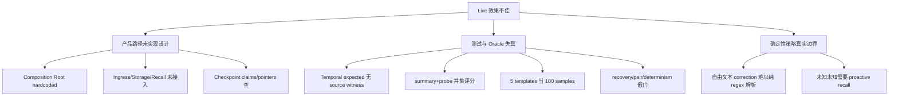

# 根因模型：实现、测试还是架构？

## 根因树

## 判定

1. **实现有问题：是，且是主因。** 当前产品不是文档描述的 Runtime。
2. **测试有问题：是，足以使 temporal 和闭环结论失效。**
3. **架构有问题：原方向并未被证伪，但任务拆分和 Composition 治理有问题。** 过多横向包导致“模块完成、产品未完成”。
4. **算法是否有价值：尚未得到有效实验。** 必须重建 deterministic vertical slice 后再判。

## 最小反事实

只修 correction regex 会让 directive coverage 可能提高，但仍然不会获得：

- source-backed latest value；
- evidence pointers；
- exact recovery；
- real recall；
- multi-session isolation；
- correct token budget；
- environment-level task success。

所以不允许以单正则补丁结束本轮改造。
