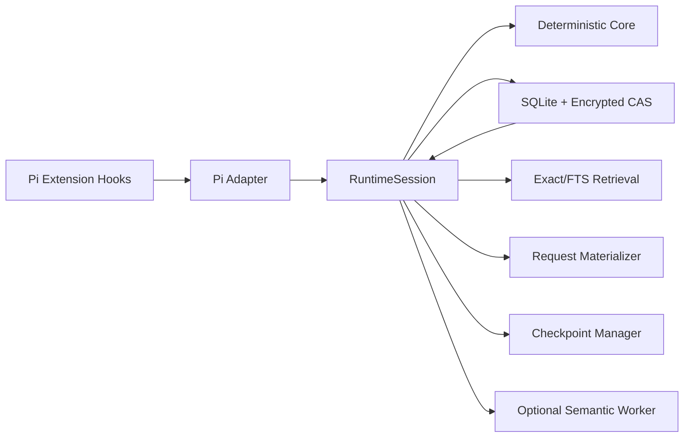

# Pi Context Runtime v2 目标架构



## 唯一状态所有者

`RuntimeSession` 是 workspace/session/branch 级唯一应用服务：

```ts
export interface RuntimeSession {
  ingestUserInput(input: UserInputEvent): Promise<UserInputReceipt>;
  ingestToolResult(input: ToolObservation): Promise<ProjectedToolResult>;
  materialize(input: MaterializationRequest): Promise<MaterializedView>;
  prepareCompaction(input: CompactionRequest): Promise<CompactionDecision>;
  acknowledgeCompaction(input: CompactionAck): Promise<void>;
  onBranchChanged(input: BranchChanged): Promise<void>;
  close(): Promise<void>;
}
```

Pi Adapter 不得调用 store/reducer/materializer 子模块；只能调用这些 application methods。

## 两条事实链

- Pi JSONL：会话结构、消息、branch、compaction host commit；
- Runtime Store：raw user/tool evidence、directives、claims、continuity、receipts、indexes。

两者通过 Saga correlation，而不是伪装成跨存储 ACID。
